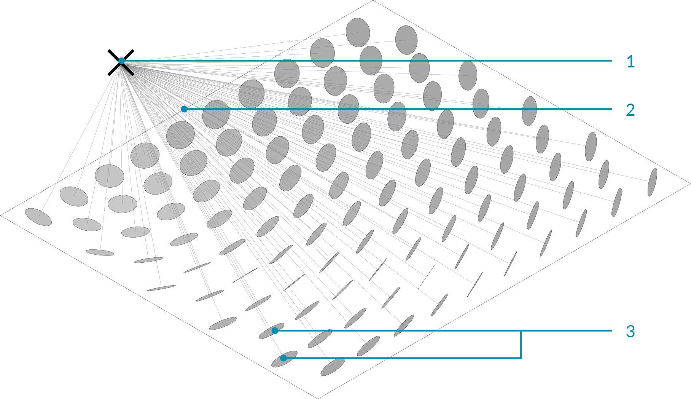
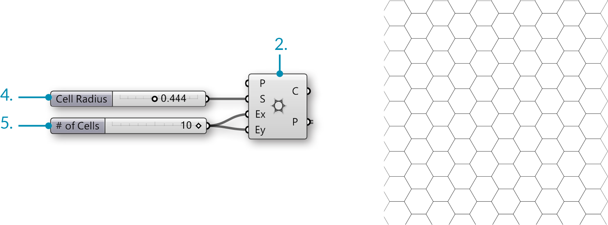

### 1.3.2. Working with Attractors

#####Attractors are points that act like virtual magnets - either attracting or repelling other objects. In Grasshopper, any geometry referenced from Rhino or created withinGrasshopper can be used as an attractor. Attractors can influence any number of parameters of surrounding objects including scale, rotation, color, and position. These parameters are changed based on their relationship to the attractor geometry.

>1. Attractor point
2. Vectors
3. Circles orient towards attractor based on their normals

In the image above, vectors are drawn between an attractor point and the center
point of each circle. These vectors are used to define the orientation of the
circles so they are always facing the attractor point.
This same attractor could be used to change other parameters of the circles. For
example, circles that are closest to the attractor could be scaled larger by using
the length of each vector to scale the radius of each circle.

####1.3.2.1. ATTRACTOR DEFINITION
In this example, we will use an attractor point to orient a grid of circles, based on the vectors between the center points of the circles and the attractor point. Each circle will orient such that it is normal to (facing) the attractor point.

||||
|--|--|--|
|01.| Type Ctrl+N in Grasshopper to start a new definition||
|02.| Vector/Grid/Hexagonal - Drag and drop the Hexagonal Grid component onto the canvas||
|03.| Params/Input/Slider - Drag and drop two Numeric Sliders on the canvas||
|04.| Double-click on the first slider and set the following:<ul>Name: Cell Radius Rounding: Floating Point Lower Limit: 0.000 Upper Limit: 1.000 Value: 0.500</ul>||
|05.| Double-click on the second slider and set the following:<ul>Name: # of Cells Rounding: Integers Lower Limit: 0 Upper Limit: 10 Value: 10</ul>||
|06.| Connect the Number Slider (Cell Radius) to the Size (S) input of the Hexagon Grid component||
|07.| Connect the Number Slider (# of Cells) to the Extent X (Ex) input and the Extent Y (Ey) input of the Hexagon Grid component|||

||||
|--|--|--|
|08.| Curve/Primitive/Circle CNR - Drag and drop a Circle CNR component onto the canvas||
|09.| Connect the Points (P) output of the Hexagon Grid to the Center (C) input of the Circle CNR component||
|10.| Connect the Number Slider (Cell Radius) to the Radius (R) input of the Circle CNR component.||
|11.| Vector/Vector/Vector 2Pt - Drag and Drop the component Vector 2Pt||
|12.| Connect the Points output (P) of the Hexagonal Grid component to the Base Point (A) input of the Vector 2Pt component.||
|13.| Params/Geometry/Point – Drag and Drop the Point component onto the canvas||
|14.| Right-Click the Point component and select set one point. In the model space select where you would like the attractor point to be||
|15.| Connect the Point component to the Tip Point (B) input of the Vector 2Pt component||
|16.| Connect the Vector (V) output of the Vector 2Pt to the Normal (N) input of the Circle CNR component.||

||||
|--|--|--|
|17.| Curve/Util/Offset – Drag and Drop the Offset Component onto the canvas.||
|18.| Params/Input/Slider - Drag and drop a Numeric Slider on the canvas||
|19.| Double-click on the slider and set the following:<ul>Name: Offset Distance Rounding: Floating Point Lower Limit: - 0.500 Upper Limit: 0.500 Value: -0.250</ul>||
|20.| Connect the Number Slider (Offset Distance) to the Distance (D) input of the offset component|||

||||
|--|--|--|
|21.| Surface/Freeform/Boundary Surfaces – Drag and drop Boundary Surfaces on to the canvas||
|22.| Connect the Curves (C) output of the offset component to the Edges (E) input of the Boundary Surfaces||

