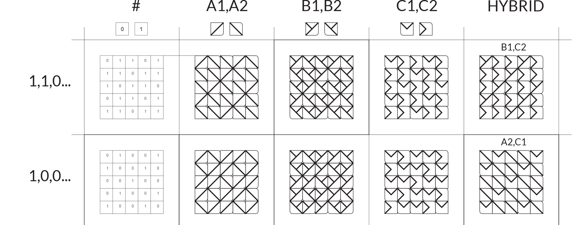

### 1.4.7. WORKING WITH LISTS

Lets take a look at an example using the components from the previous section. In this example, we are creating a tile pattern by mapping geometry to a rectangular grid. The pattern is created by using the List Item component to retrieve the desired tile from a list of geometry.

>1. Geometry corresponding to index 1
2. Geometry corresponding to index 0
3. Rectangular grid

>1. Mapping pattern
2. Mapped geometry

||||
|--|--|--|
|01.| Start a Rhinoceros File. ||
|02.| Create two equally sized squares.||
|03.| Create different geometries in each square. <blockquote>In the example shown above, we created a simple surface with a tab. The tab is filleted to demonstrate the orientation and the base is filleted to distinguish the two geometries.</blockquote>||
|04.| Start a new definition, type Ctrl+N (in Grasshopper).||
|05.| **Params/Geometry/Geometry** – Drag and drop two **Geometry** parameters onto the canvas.| |
|06.| Right-Click the first **Geometry** Parameter and select set one Geometry. Set the first Geometry that you are referencing. ||
|07.| Right-Click the second **Geometry** Parameter and select set one Geometry. Set the second Geometry that you are referencing.  <blockquote>It is possible to reference multiple geometries in a single parameter, but for simplicity were are using two separate parameter components.</blockquote>||
|08.| **Params/Geometry/Curve** – Drag and drop two **Curve** parameters onto the canvas.||
|09.| Right-Click the first **Curve** Parameter and select set one Curve. Set the first square that you are referencing.||
|10.| Right-Click the second **Curve** Parameter and select set one Curve. Set the second square that you are referencing.  <blockquote>Be sure that the geometry and the square that you are referencing correspond.</blockquote>||
|11.| **Vector/Grid/Rectangular** – Drag and drop a **Rectangular Grid** component onto the canvas. ||
|12.| **Params/Input/Slider** - Drag and drop three **Number Sliders** on the canvas. ||
|13.| Double-click on the first **Number Slider** and set the following:<ul>Rounding: Integers Lower Limit: 0 Upper Limit: 10 Value: 10 </ul>||
|14.| Double-click on the second **Number Slider** and set the following:<ul>Rounding: Integers Lower Limit: 0 Upper Limit: 10 Value: 10 </ul>||
|15.| Double-click on the third **Number Slider** and set the following:<ul>Name: Extents X & Y Rounding: Integers Lower Limit: 0 Upper Limit: 10 Value: 10 </ul>||
|16.| Connect the first **Number Slider** to the Size X (Sx) input of the **Rectangular Grid** component.||
|17.| Connect the second **Number Slider** to the Size Y (Sy) input of the **Rectangular Grid** component.||
|18.| Connect the third **Number Slider** to the Extent X (Ex) input and the Extent Y (Ey) input of the **Rectangular Grid** component.|||

||||
|--|--|--|
|19.| **Sets/Tree/Merge** – Drag and drop two **Merge** components onto the canvas.||
|20.| Connect the first **Geometry** parameter to Data Stream 1 (D1) input of the first **Merge** component. ||
|21.| Connect the second **Geometry** parameter to Data Stream 2 (D2) input of the first **Merge** component. ||
|22.| Connect the first **Curve** parameter to Data Stream 1 (D1) input of the second **Merge** component. ||
|23.| Connect the second **Curve** parameter to Data Stream 1 (D2) input of the second **Merge** component. ||
|24.| Right-click the Cells (C) output of the **Rectangular Grid** component and select Flatten. |||

||||
|--|--|--|
|25.| **Sets/List/List Length** – Drag and drop a **List Length** component onto the canvas.||
|26.| Connect the Cells (C) output of the **Rectangular Grid** component to the List (L) input of the **List Length** component. ||
|27.| **Sets/Sequence/Repeat Data** – Drag and drop a **Repeat Data** component onto the canvas.||
|28.| Connect the Length (L) output of the **List Length** component to the Length (L) input of the **Repeat Data** component. ||
|29.| **Params/Input/Panel** – Drag and drop a **Panel** onto the canvas.||
|30.| Double-click the **Panel**. Deselect multiline data, wrap items, and special codes. Enter the following:<ul>1 0 0</ul> <blockquote>This is the pattern in which the geometries are being distributed. 0 is calling out the first referenced Geometry and 1 is calling out the second referenced Geometry. Changing the number sequence will change the pattern, as will changing the extents of the grid.</blockquote>||
|31.| Connect the **Panel** to the Data (D) input of the **Repeat Data** component.|||

||||
|--|--|--|
|32.| **Sets/List/List Item** – Drag and drop two **List Item** components.||
|33.| Connect the Result (R) output of the first **Merge** component to the List (L) input of the first **List Item**component.||
|34.| Connect the Result (R) output of the second **Merge** component to the List (L) input of the second **List Item** component.||
|35.| Connect the Data (D) output of the **Repeat Data** component to the Index (i) input of the first and second **List Item** components.||
|36.| **Transform/Affine/Rectangle Mapping** – Drag and Drop the **Rectangle Mapping** component onto the canvas.||
|37.| Connect the Cells (C) output of the **Rectangular Grid** component to the Target (T) input of the **Rectangular Mapping** component.||
|38.| Connect the items (I) output of the first **List Item** component to the Geometry (G) input of the **Rectangular Mapping** component.||
|39.| Connect the items (I) output of the second **List Item** component to the Source (S) input of the **Rectangular Mapping** component.|||

Changing the input geometry and the pattern will change the final tile pattern.

