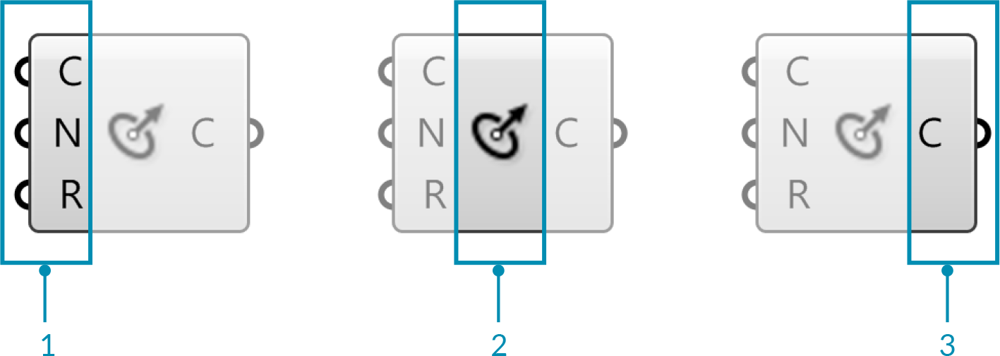
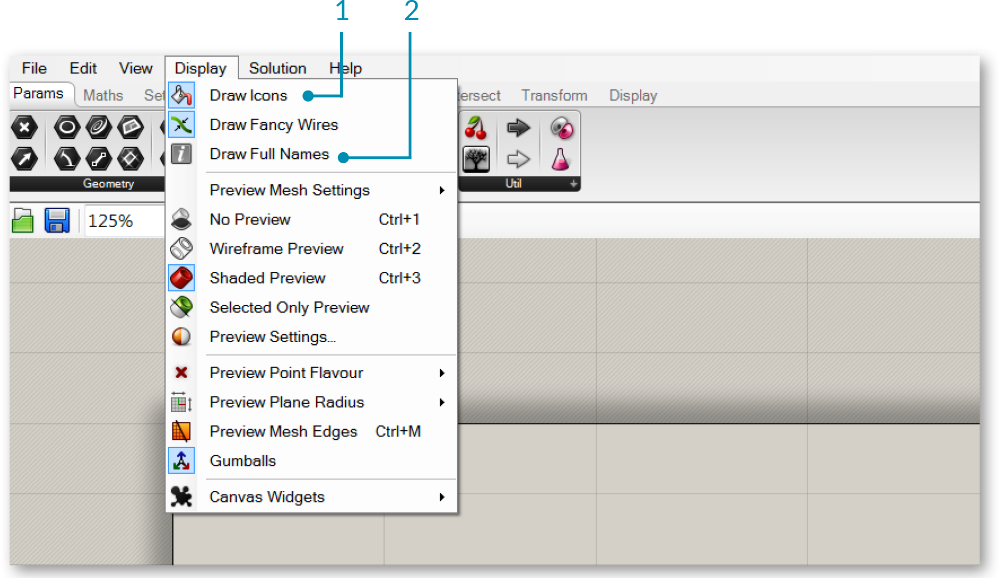
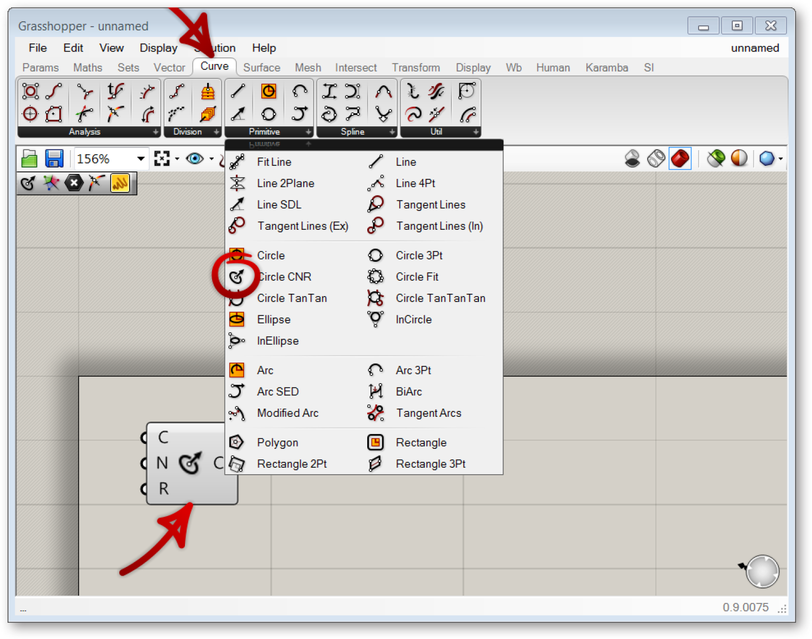
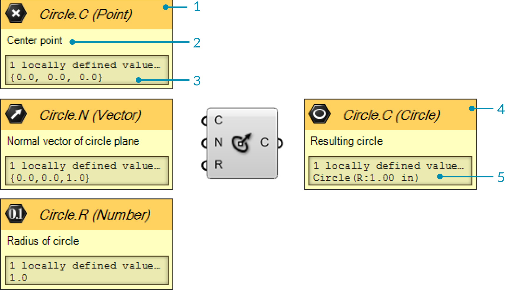
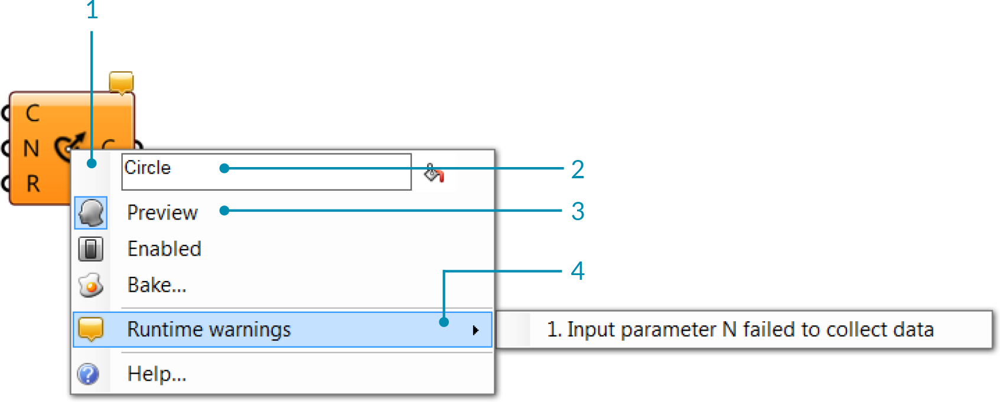
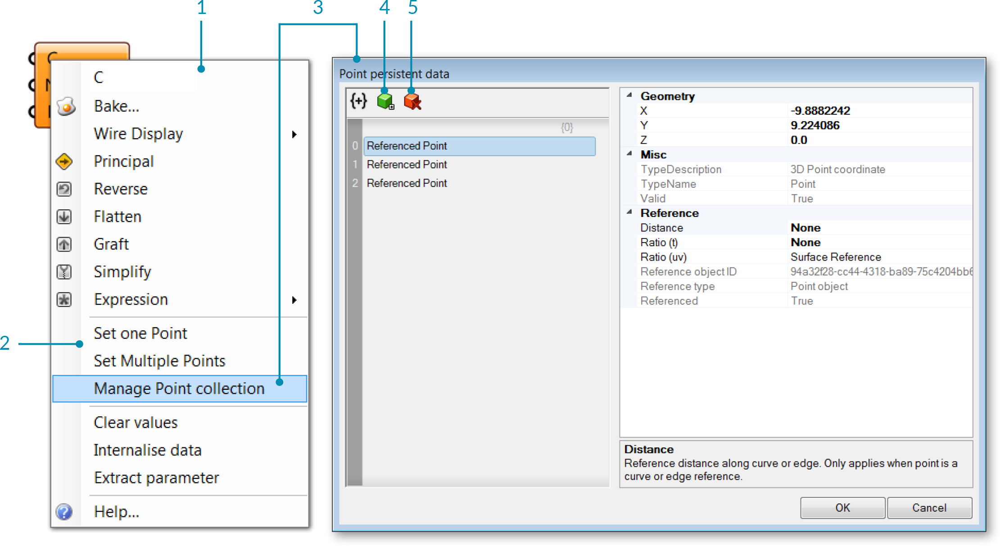
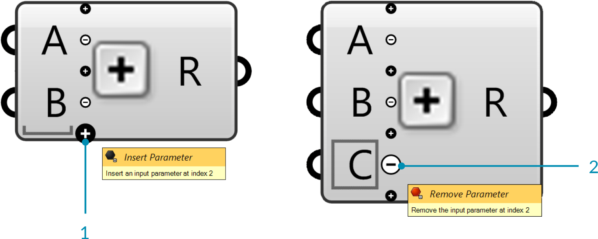

## 1.2.2 GRASSHOPPER COMPONENT PARTS

#####Components are the objects you place on the canvas and connect together with Wiresto form a visual program. Components can represent Rhino Geometry or operationslike Math Functions. Components have inputs and outputs.

>1. The three input parameters of the Circle CNR component.
2. The Circle CNR component area.
3. The output parameter of the Circle CNR component.

A component requires data in order to perform its actions, and it usually comes up with a result. That is why most components have a set of nested parameters, referred to as Inputs and Outputs, respectively. Input parameters are positioned along the left side, output parameters along the right side.

There are a few Grasshopper components that have inputs but no outputs, or vice versa. When a component doesn’t have inputs or outputs, it will have a jagged edge.

###1.2.2.1 LABEL VS ICON DISPLAY
Every Grasshopper object has a unique icon. These icons are displayed in
the center area of the object and correspond to the icons displayed in the component palettes. Objects can also be displayed with text labels. To switch between icon and label display, Select “Draw Icons” from the display menu. You can also select “Draw Full Names” to display the full name of each object as well as its inputs and outputs.

>1. Switch between Icon and Label display.
2. Display the full name of the component and its inputs and outputs

>1. The Circle CNR component in Label Display
2. The Circle CNR component in Icon Display
3. The Circle CNR component with full names displayed

We reccommend using icon display to familiarize yourself with the component icons so you can quickly locate them in the palettes. This will also enable you to understand definitions at a glance. Text labels can be confusing because different components may share the same label.

>Circle CNR and Circle 3pt have the same label, but different icons.

One feature that can help you familiarize yourself with the location of
components in the palettes is holding down Ctrl + Alt and clicking on an existing component on the canvas. This will reveal its location in the palette.

###1.2.2.2 COMPONENT HELP
Right clicking an object and selecting “Help” from the drop-down menu will open a Grasshopper help window. The help window contains a more detailled description of the object, a list of inputs and outputs, as well as remarks.

>1. Grasshopper help window for the Point parameter
2. The remarks in the help window give additional insight about the point parameter.

###1.2.2.3 TOOL TIPS
Component inputs are expecting to receive certain types of data, for example a Component might indicate that you should connect a point or plane to its input. When you hover your mouse over the individual parts of a Component object, you’ll see different tooltips that indicate the particular type of the sub-object currently under the mouse. Tooltips are quite informative since they tell you both the type and the data of individual parameters.

>1. Header of the tooltip shows the icon for the input type, the name of the Component, the label for the input, and the input type again in text format.
2. The flain language description of what the input is for the Component.
3. Any values defined for the input - either locally or from its connected wire.
4. The header of the output tooltip provides the same detail os for inputs, but for the corresponding output.
5. The result of the component's action.

###1.2.2.4 CONTEXT POPUP MENUS
All objects on the Canvas have their own context menus that expose their
settings and details. You can access this context menu by right-clicking on the center area of each component. Inputs and outputs each have their own context menus which can be accessed by right-clicking them.

>1. Component context menu.
2. Editable text field that lists the name of the object.
3. Preview flag - indicates whether or not the geometry produced by this object will be visible in the Rhino viewports. Switching off preview will speed up both the Rhino viewport frame-rate and the time taken for a solution.
4. Runting warnings - lists warnings that are hindering the functioning of the component.

>1. C input context menu.
2. Set one or multiple points - allows you to select reference geometry in the Rhino viewport.
3. Manage Point collection - opens a dialog that allows you to add or remove points from the point collection and view information about each point.
4. Add item to collection.
5. Delete selection.

###1.2.2.5 ZOOMABLE USER INTERFACE
Some components can be modified to increase the number of inputs or outputs through the Zoomable User Interface (ZUI). By zooming in on the component on the canvas, an additional set of options will appear which allows you add or remove Inputs or Outputs to that component. The Addition component allows you to add inputs, representing additional items for the addition operation.

>1. Click the - sign to remove an Input.
2. Click the + sign to add an Input.

The panel component also has a zoomable user interface. A Panel is like a Post-It™ sticker. It allows you to add little remarks or explanations to a Document. You can change the text through the menu or by double-clicking the panel surface. Panels can also receive and display data from elsewhere. If you plug an output into a Panel, you can see the contents of that parameter in real-time. All data in Grasshopper can be viewed in this way. When you zoom in on a panel, a menu appears allowing you to change the background, font, and other attributes. These options are also available when you right-click the panel

>1. Drag grips to adjust panel margins.
2. Increase or reduce the font size of the panel content.
3. Change the alignment of panel content.
4. Select a font for ponel conent.
5. Select a color for the panel background. You can set a new default color for your panels by right clicking the panel and selecting "Set Defaut Color".

