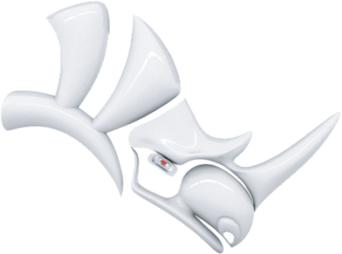
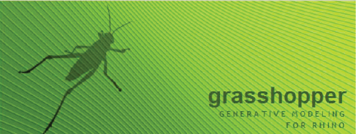

##About This Primer

###Authors

#####Gil Akos, Mode Lab
Gil Akos is a founding partner and Director of Technology at Mode Lab, a
multidisciplinary design consultancy specializing in technology-driven process
innovation. He brings diverse professional experience, technical expertise in
digital platforms, and a passion for generative design to the service model of the
studio. His personal interests surround the relationship between simulation and
materialization and ways by which this connection can be made tangible. 
http://modelab.is 
http://modelab.is/education

#####Ronnie Parsons, Mode Lab
Ronnie Parsons is a founding partner and Director of Education at Mode Lab, a
multidisciplinary design consultancy specializing in technology-driven process
innovation. At Mode Lab, Ronnie identifies new ways to connect and configure
client workflows by strategically aligning product vision with UX-centered
technology platforms. Ronnie’s expertise resides in the areas of advanced
computational modeling, instructional design, and research and development. 
http://modelab.is 
http://modelab.is/education

#####Mode Lab Team:
<ul>Sharon Jamison 
Andrew Reitz 
Armon Jahanshahi 
Luis Quinones 
Erick Katzenstein 
Kimberly Parsons 
Roberto Godinez 
Christopher Morse</ul>

###Contributors

#####Andrew Payne, Principal, Lift Architects
Andrew Payne is a registered architect who founded LIFT architects in 2007. Andrew’s work explores embedded computation, intelligent buildings,
and generative design and he has published papers and taught workshops
throughout North America and Europe. In 2010, Andrew and Jason K. Johnson
published Firefly - a comprehensive software plug-in dedicated to bridging the
gap between Grasshopper, the Arduino microcontroller, the internet, audio/
visual tools, and more. 
http://www.liftarchitects.com/

---

This primer provides a comprehensive guide to the most current Grasshopper build, version 0.90076, highlighting what we feel are some of the most exciting feature updates. It is our goal that this primer will serve as a field guide to new and existing users looking to navigate the ins and outs of using Grasshopper in their creative practice.

Mode Lab is a multidisciplinary design consultancy specializing in technology-driven process innovation.
From its inception, Mode Lab has been a space for experimenting with the methods and technology used to design and make the world around us. We are compelled to understand and improve upon the process of materializing ideas – this is a journey we undertake in collaboration with our clients.
http://modelab.is

Our Mode Lab Education brand provides blended learning solutions for consumers and businesses looking to get ahead. We design and develop targeted learning experiences that keep the learner at the center of every technique and design method we share with our community.
http://modelab.is/education

McNeel is a software development company with worldwide sales, support, and training. Founded in 1980, McNeel is a privately-held, employee-owned company with sales and support offices and affiliates in Seattle, Boston, Miami, Buenos Aires, Barcelona, Rome, Tokyo, Taipei, Seoul, Kuala Lumpur, and Shanghai with more than 700 resellers, distributors, OEMs, and training centers around the world.
http://www.en.na.mcneel.com/

For designers who are exploring new shapes using generative algorithms, Grasshopper is a graphical algorithm editor tightly integrated with Rhino’s 3D modeling tools. Unlike RhinoScript, Grasshopper requires no knowledge of programming or scripting, but still allows designers to build form generators from the simple to the awe-inspiring.
http://www.grasshopper3d.com/

###LICENSING INFORMATION
The Grasshopper Primer is licensed under the Creative Commons Attribution-NonCommercial-ShareAlike 3.0 Unported license. The full text of this license is available here: http://creativecommons.org/licenses/by-nc-sa/3.0/us/legalcode

Under this license, you are free:

**TO SHARE** - to copy, distribute and transmit the work

**TO REMIX** - to adapt the work

Under the following conditions:

**ATTRIBUTION** - You must attribute the work in the manner specified as “Mode Lab’s Attribution” below. You cannot attribute the work in any manner that suggests that Mode Lab endorses you or your use of the work.

**NONCOMMERCIAL** - You may not use this work for commercial purposes

**SHARE ALIKE** - If you alter, transform, or build upon this work, you may distribute the resulting work only under the same Creative Commons Attribution-NonCommercial-ShareAlike 3.0 Unported license.

Please see the full text of this license (http://creativecommons.org/licenses/by-nc-sa/3.0/us/legalcode) to view all rights and restrictions associated with it.

**MODE LAB’S ATTRIBUTION:**
©2014 Studio Mode, LLC. All rights reserved. http://modelab.is

**TRANSLATIONS:**
If you create translated versions of this Primer (in compliance with this license), please notify Mode Lab at hello@modelab.is. Mode Lab may choose to distribute and/or link to such translated versions (either as-is, or as further modified by Mode Lab)
