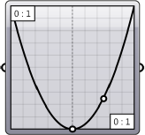

## 2.1. Index

#####This index provides additional information on all the components used in this primer, as well as other components you might find useful. This is just an introduction to over 500 components in the Grasshopper plugin.

Parameters
--

####Geometry
||||
|--|--|--|
|P.G.Crv|Curve Parameter Represents a collection of Curve geometry. Curve geometry is the common denominator of all curve types in Grasshopper.||
|P.G.Circle|Circle Parameter Represents a collection of Circle primitives.||
|P.G.Geo|Geometry Parameter Represents a collection of 3D Geometry.||
|P.G.Pipeline|Geometry Pipeline Defines a geometry pipeline from Rhino to Grasshopper.||
|P.G.Pt|Point Parameter Point parameters are capable of storing persistent data. You can set the persistent records through the parameter menu.||
|P.G.Srf|Surface Parameter Represents a collection of Surface geometry. Surface geometry is the common denominator of all surface types in Grasshopper.||

####Primitive
||||
|--|--|--|
|P.P.Bool|Boolean Parameter Represents a collection of Boolean (True/False) values.||
|P.P.D|Domain Parameter Represents a collection of one-dimensional Domains. Domains are typically used to represent curve fragments and continuous numeric ranges. A domain consists of two numbers that indicate the limits of the domain, everything in between these numbers is part of the domain.||
|P.P.D2|Domain2 Parameter Contains a collection of two-dimensional domains. 2D Domains are typically used to represent surface fragments. A two-dimensional domain consists of two one-dimensional domains.||
|P.P.ID|Guid Parameter Represents a collection of Globally Unique Identifiers. Guid parameters are capable of storing persistent data. You can set the persistent records through the parameter menu.||
|P.P.Int|Integer Parameter Represents a collection of Integer numeric values. Integer parameters are capable of storing persistent data. You can set the persistent records through the parameter menu.||
|P.P.Num|Number Parameter Represents a collection of floating point values. Number parameters are capable of storing persistent data. You can set the persistent records through the parameter menu.||
|P.P.Path|File Path Contains a collection of file paths.||

####Input
||||
|--|--|--|
|P.I.Toggle|Boolean Toggle Boolean (true/false) toggle.||
|P.I.Button|Button Button object with two values. When pressed, the button object returns a true value and then resets to false.||
|P.I.Swatch|Color Swatch A swatch is a special interface object that allows for quick setting of individual color values. You can change the color of a swatch through the context menu.||
|P.I.Grad|Gradient Control Gradient controls allow you to define a color gradient within a numeric domain. By default the unit domain (0.0 ~ 1.0) is used, but this can be adjusted via the L0 and L1 input parameters. You can add color grips to the gradient object by dragging from the color wheel at the upper left and set color grips by right clicking them.||
|P.I.Graph|Graph Mapper Graph mapper objects allow you to remap a set of numbers. By default the {x} and {y} domains of a graph function are unit domains (0.0 ~ 1.0), but these can be adjusted via the Graph Editor. Graph mappers can contain a single mapping function, which can be picked through the context menu. Graphs typically have grips (little circles), which can be used to modify the variables that define the graph equation. By default, a graph mapper objects contains no graph and performs a 1:1 mapping of values.||
|P.I.Slider|Number Slider A slider is a special interface object that allows for quick setting of individual numeric values. You can change the values and properties through the menu, or by double-clicking a slider object. Sliders can be made longer or shorter by dragging the rightmost edge left or right. Note that sliders only have an output (ie. no input).||
|P.I.Panel|Panel A panel for custom notes and text values. It is typically an inactive object that allows you to add remarks or explanations to a Document. Panels can also receive their information from elsewhere. If you plug an output parameter into a Panel, you can see the contents of that parameter in real-time. All data in Grasshopper can be viewed in this way. Panels can also stream their content to a text file.||
|P.I.List|Value List Provides a list of preset values from which to choose.||
