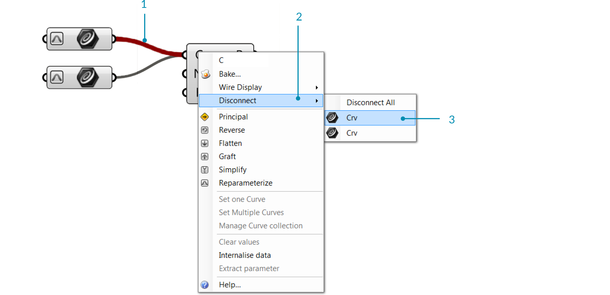

### 1.2.4. KOMPONENTEN VERKABELN

#####Wenn Daten nicht in einem permanenten Satz eines Parameters gespeichert sind, muessen sie von einer anderen Quellen uebernommen werden. Daten werden von einer Komponente zur anderen durch Kabel uebertragen. Du kannst Dir diese buchstaeblich als elektrische Kabel vorstellen, die Datenimpluse von einem Objekt zum anderen uebertragen.

####1.2.4.1. VERBINDUNGSMANAGEMENT
Um Komponenten zu verbinden, klicke und ziehe nahe dem Kreis an der Ausgabeseite eines Objektes. Ein Verbindungskabel wird and Deiner Maus angeheftet. Sobald die Maus ueber einem moeglichen Zieleingabeparameter schwebt, wird sich da Kabel verbinden und verfestigen. Dies ist keineswegs eine permanente Verbindung bis Du die Maustaste loslaesst. Es macht keinen Unterschied, ob weir die Verbindungen von "links nach rechts" oder von "rechts nach links" erstellen.

>1. Die "Divide Curve" Komponente teilt eine Kurve in gleich lange Segmente.
2. "Curve" Parameter - rechtsklicke und waehle "Set One Curve" um eine Rhinogeometrie zu referenzieren.

>Linksklicke und ziehe ein Kabel vom Ausgabeparameter (1.) eines Objekts zu einem Eingabeparameter (2.) eines anderen.

>4. Wenn Du STRG haeltst, wird der cursor rot werden und die Zielquelle wird aus der Quellenliste entfernt werden.
5. Als Standard werden neue Verbindungen bestehende Verbindungen loeschen. Halte SHIFT gedrueckt, waehrend Du das Verbindungskabel ziehst um mehrere Quellen zu definieren. Der Kursor wird gruen um das additive Verhalten darzustellen.

>6. Du kannst Kabel ebenfalls durch das Kontextpopupmenu entfernen - rechtsklicke auf den Griff am Eingabe- oder Ausgabeparameter und waehle "disconnect".
7. Wenn mehrere Verbindungen bestehen, kannst Du in einer Liste aussuchen, welche Du loesen moechtest.
8. Wenn Du Deine Maus ueber ein Element bewegst, werden die entsprechenden Verbindungen in rot hervorgehoben.

####1.2.4.2. FANCY WIRES
Kabel repraesentieren die Verbindungen, sowie den Fluss der Daten in einem Graph einer Definition. Grasshopper kann nun auch visuellen Hinweise darauf geben, was in den Kabel so vor sich geht. Die Standardeinstellung fuer diese sogenannten “fancy wires” ist ausgeschalten, weshakb Du sie einschalten musst, bevor Du die verschiedenen Typen von Linien fuer die Verbindungskabel sehen kannst. Um dies zu tun, klicke einfach auf den "View Tab" in der Hauptmenuleiste und waehle den Knopf genannt “Draw Fancy Wires”. Fancy wires kann Dir viele Informationen darueber welche Typen von Information von einer Komponente zur anderen fliesen geben.

>1. Leeres Element - Ein orangener Kabeltyp zeigt an, dass keine Information darin uebertragen wird. Dieser Parameter hat eine Warnung erzeugt weil er keine Daten enthaelt und damit keine Information ueber das Kabel gesendet wird.
2. Die "Merge" Komponente ist eine alternative um mehrere Quellen mit einem einzelnen Eingabeparameter zu verbinden. 
3. Liste – Wenn die Information, welche von einer Komponente ausfliest eine Liste von Informationen enthaelt, wird der Kabeltyp als graue Doppellinie dargestellt.
4. Einzelnes Element – Die Daten aus einem beliebigen Parameter enthalten ein einzelnes Element und das Kabel wird as durchgehende graue Linie dargestellt.
5.  Baum – Informationen, die zwischen Komponenten uebertragen werden und eine Datenstruktur enthalten, weden als graue, gestrichelte Doppellinie dargestellt.

####1.2.4.3. KABELDARSTELLUNG
Wenn Du eine lange Zeit damit zugebracht hast an einer einzelnen Grasshopper definition zu arbeiten, hast Du eventuell gemerkt, dass die Leinwand mit relativ schnell mit einer Menge kabel zugekleistert wird. Gluecklicherweise haben wir die Faehigkeit die Darstellung der Kabel fuer jeden einzelnen Eingabeparameter einer Komponente zu bestimmen.

Dabei gibt es drei Kabeldarstellungen: "Default Display", "Faint Display", and "Hidden Display". Um die Kabeldarstellung zu bearbeiten, rechtsklicke einfach auf den Eingabeparameter einer Komponente und waehle eine der Darstellungen im "Wire Display" Popupmenu aus.

>1. Versteckte Darstellung – Wenn "hidden display" ausgewaehlt wurde, wird das Kabel komplett unsichtbar. Die Daten werden dann kabellos von der Quelle zum Eingabeparameter uebertragen. Wenn Du die Quelle oder die Zielkomponente auswaehlst, wird ein gruenes Kabel erscheinen und Dir zeigen welche Komponenten untereinander verbunden sind. Sobald Du die Komponente nicht mehr ausgewaehlt hast, wird das Kabel wieder verschwinden.
2. Standarddarstellung – Die Option "Default Wire Display" wird alle Verbindungen zeigen (wenn "Fancy Wires" eingeschalten wurde).
3. Matte Darstellung – "Faint Wire Display" zeichnet eine sehr duenne, semitransparente Verbindung. Matte und versteckte Darstllung koennen sehr hilfreich sein, wenn viele Quellkabel an einem einzelnen Eingabeparameter ankommen.