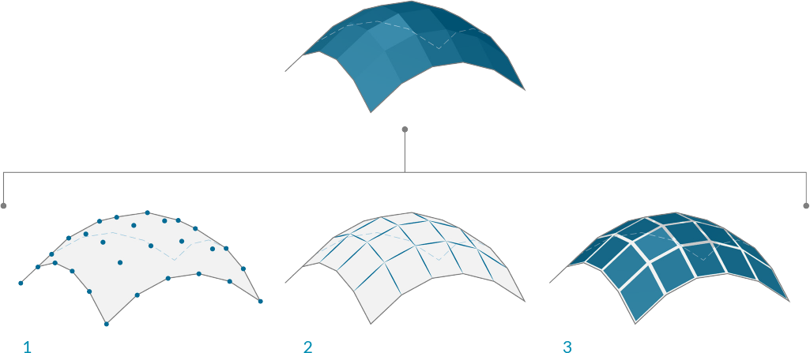
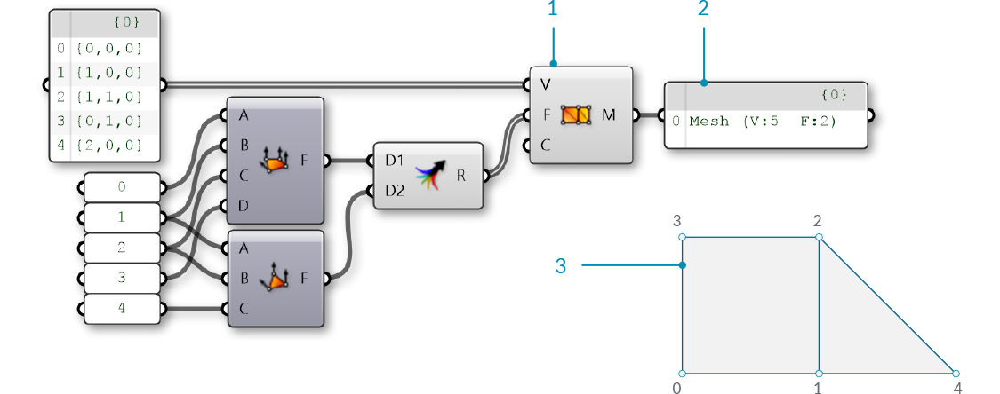
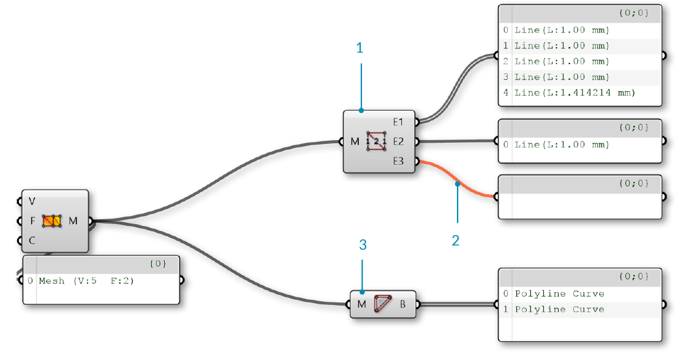

### 1.6.1 Was ist ein Polygonnetz?

#####Ein Polygonnetz ist eine Sammlung von Vierecken und Dreiecken, die eine Flaeche oder einen Koerper darstellen. Dieser Anschnitt beschreibt die Struktur von Polygonnetzobjekten, welche aus Eckpunkten, Kanten und Oberflaechen, sowie zusaetzlichen Polygonnetzeigenschaften, wie Farben und Normalen, bestehen.

>1. Mesh Eckpunkte
2. Mesh Kanten
3. Mesh Oberflaechen

####1.6.1.1 Grundsaetzliche Anatomie von Meshes

Grasshopper definiert Meshes mit einer Oberflaechen-Eckpunkte Datenstruktur. Auf der einfachsten Ebene, ist diese Struktur eine Ansammlung von Punkten, die in Polygonen gruppiert sind. Die Punkte des Mesh nennen wir *vertices*, waehrend die Polygone *faces* genannt werden. Um ein Mesh zu erstellen, benoetigen wir eine Liste von Eckpunkten und ein System um diese in "Faces" zu gruppieren.

>1. Eine Liste von "Vertices"
2. "Faces" als Gruppierung von "Vertices"

**Vertices**

Die Vertices eines Mesh sind einfach eine Liste von Punkten. Erinnere Dich daran, dass eine Liste in Grasshopper eine Sammlung von Objekten darstellt. Jedes Objekt in der Liste hat einen *index*, der die Position von Objekten in einer Liste beschreibt. Der Index von Vertices ist sehr wichtig wenn ein Mesh konstruiert wird, oder wenn Informationen ueber die Struktur des Mesh benoetigt werden.

>1. Eine Liste von Punkten. Alle Listen in Grasshopper beginnen mit einem Index von 0
2. Die Menge an Punkten mit ihrem entsprechenden Index benannt

**Faces**

Ein Face ist eine geordnete Liste von drei oder vier Vertices. Die Flaechendarstellung eines Meshface ist deshalb durch die Position der Vertices beschrieben. Wir haben bereits eine Liste von Vertices, die ein Mesh bestimmen, also werden wir einfach die Indices des Vertices heranziehen, anstatt einzelne Punkte zur Beschreibung der Faces bereitzustellen. Dies ermoeglicht es uns die selben Vertices in mehreren Faces zu nutzen.

>1. Ein viereckiges Face bestehend aus Indices 0, 1, 2, und 3
2. Ein dreieckiges Face bestehend aus Indices 1, 4, und 2

In Grasshopper, werden Faces entweder mit **Mesh Triangle** oder mit **Mesh Quad** Komponenten erzeugt. Der Eingabeparameter fuer diese Komponenten besteht aud Integerlisten, die den Indices der Vertices entsprechen, die wir fuer unser Face nutzen wollen. Indem wir ein **Panel** mit dem Ausgabeparameter dieser Komponente verbinden, koennen wir sehen, dass dreieckige Faces als T{A;B;C} beschrieben werden, und viereckige Faces als Q{A;B;C;D}. Faces mit mehr als vier Seiten sind nicht zulaessig. Um ein fuenfseitiges Meshelement herzustellen, muss das Mesh in zwei oder mehr Faces zerlegt werden.

>1. **Mesh Quad** Komponente mit Indices 0, 1, 2, und 3
2. **Mesh Triangle** Komponente mit Indices 1, 4, und 2

Es ist wichtig sich daran zu erinnern, dass diese Komponenten nicht zur Erzeugung einer Meshgeometrie fuehren, sondern der Ausgabeparameter eine Liste von Indices liefert, die definieren wie ein Mesh erzeugt werden soll. Indem wir dem Format dieser Liste Beachtung schenken, koennen wir auch manuell Faces editieren, indem wir eine **Panel** Komponente nutzen, um ein korrektes Format fuer entweder ein dreieckiges oder ein viereckiges Face anzugeben.

>1. Ein Face, das mit einer **Mesh Quad** Komponente erzeugt wurde
2. Ein Face, das mit einem **Panel** erzeugt wird
3. Ein Paneel Eigenschaftenfenster wird automarisch geoeffnet, wenn ein Paneel doppelgeklickt wird oder nach einem Rechtsklick "Edit Notes..." gewaehlt wird

So weit haben wir eine Liste mit Veritces und ein Set Facedefinitionen, aber noch kein Mesh erzeugt. Damit ein Mesh erzeugt wird, muessen wir die Faces und Vertices miteinander durch eine **Construct Mesh** Komponente verbinden. Wir verbinden unsere Liste mit Vertices mit dem V Eingabeparameter, und eine verschmolzene Liste der Faces mit dem F Eingabeparameter (Die Komponente hat auch einen optionalen Farbeingabeparameter, den wir unten noch behandeln werden.) Wenn wir ein Paneel mit dem Ausgabeparameter der**Construct Mesh** Komponente verbinden, werden wir die Informationen zu der Anzahl der Faces und Vertices erhalten.

>1. Die **Construct Mesh** Komponente nimmt eine Liste von Vertices und Faces als Eingabeparameter. Der Farbeingabeparameter ist optional und bleibt im Moment ungenutzt.
2. Ein Paneel zeigt, dass wir ein Mesh mit 5 Vertices und 2 Faces erzeugt haben
3. Das resultierende Mesh (die Vertices wurden mit ihre Indizes benannt)

Als Standard zeigt Grasshopper die Kanten von Meshgeometrien in der Vorschau nicht an. Um die Kanten in der Vorschau zu sehen, kannst Du die Meshkantenvorschau mit dem Tastaturkuerzel Strg+M, oder indem Du im Ansichtsmenu die Option 'Preview Mesh Edges' auswaehlst.

Es ist extrem wichtig der Ordnung der Indices Aufmerksamkeit zu schenken, wenn Du ein Meshface erstellst. Das Face wird hergestellt, indem die Vertices in der angegebenen Abfolge verbunden werden. Bei viereckigen Faces sind Q{0,1,2,3} und Q{1,0,2,3} sehr verschieden, auch wenn sie beide aus den selben Vertices bestehen. Falsche Vertexeihenfolge kann zu Problemen, wie Loechern im Mesh oder nicht-mannigfaltigen Meshgeometrien oder nicht-orientierbaren Flaechen fuehren. Solche Meshgeometrien werden ueblicherweise nicht korrekt gerebdert und sind nicht moeglich 3D gedruckt zu werden. Diese Schwierigkeiten werden im Abschnitt **Understanding Topology** tiefer behandelt.

>1. Ein viereckiges Face mit den Indices 0,1,2,3
2. Ein viereckiges Face mit den Indices 0,3,1,2

####1.6.1.2 Implizite Mesh Daten

Zusaetzlich zu Faces und Vertices, gibt es andere Informationen ueber Meshed, die wir benutzen werden. In Face-Vertex-basierten Meshes, werden Daten wie *edges* und *normals* basierend auf Faces und Vertices implizit kalkuliert. Dieser Abschnitt beschreibt, wie wir diese Informationen erheben.

**Edges**

Die *edges* eines Meshs sind Linien, die zwei aufeinanderfolgende Vertices eines Face miteinander verbinden. Merke, dass einige Kanten zwischen mehreren Oberflaechen geteilt werden, waehrend andere Kanten nur an eine Oberflaeche angrenzen. Die Anzahl an Oberflaechen, die an eine Kante angrenzen, wird *Valenz* der Kante genannt.

Grasshopper gruppiert Kanten basierend auf ihrer Valenz in drei Kategorien:

1. E1 - 'Naked Edges' haben eine Valenz von 1. Sie bestimmen die auesseren Grenzen des Meshs.
2. E2 - 'Interior Edges' haben eine Valenz von 2. 
3. E3 - 'Non-Manifold Edges' haben eine Valenz von 3 oder groesser. Meshs die solche Strukturen enthalten werden "Non-Manifold" genannt und im naechsten Abschnitt besprochen.

>1. "Naked edge" mit einer Valenz von 1
2. "Interior edge" mit einer Valenz von 2
3. "Non-manifold edge" mit einer Valenz von 3

Wir koennen die **Mesh Edges** Komponente nutzen um die Kanten eines Mesh entsprechend ihrer Valenz auszugeben.  Dies ermoeglicht es Kanten entlang der Meshgrenze oder nicht-mannigfaltige Kanten zu identifizieren. Manchmal jedoch ist es nuetzlicher die gesamte Grenze jeder Oberflaeche zu erhalten. Dazu nutzen wir die **Face Boundaries** Komponente. Diese wir die Grenze einer jeden Oberflaeche als Polylinie ausgeben.

>1. Die **Mesh Edges** Komponente gibt drei Sets von Kanten aus. Dieses Mesh hat 5 "naked edges", 1 "interior edge" und keine "non-manifold edges"
2. Der E3 Ausgabeparameter ist leer, da dieses Mesh keine nicht-mannigfaltigen Kanten hat.
3. Die **Face Boundaries** Komponente gibt eine Polylinie fuer jede Oberflaeche aus

**Face Normals**

Ein *Normalenvektor* ist ein Vektor mit einer Magnitude von eins und ist rechtwinkig zu einer Flaeche angeordnet. Im Fall einer dreieckigen Oberflaeche, wissen wir, dass alle drei Punkte auf einer ebenen Flaeche liegen, so dass die Normale immer rechtwinklig zu dieser Ebene liegen. Woher wissen wir nun, in welche Richtung der Normalenvektor deutet ("hoch" oder "runter")? Wieder einmal ist die Reihenfolge der Indices ausschlaggebend. Meshoberflaechen werden in Grasshopper gegen den Uhrzeigersinn definiert, so dass eine Oberflaeche mit Vertices {0,1,2} sich umgekehrt zu einer mit Vertices {1,0,2} verhaelt. Ein anderer Weg um die Richtung zu visualisieren ist die *Rechtehandregel*. 

>1. Die **Face Normals** Komponente wird eine Liste von Zentren und Normalenvektoren fuer jede Oberflaeche ausgeben
2. Oberflaechennormalen entsprechend zur Abfolge von Vertices
3. "Rechtehandregel" zur Bestimmung der Normalenrichtung

Grasshopper erlaubt auch viereckige Oberflaechen in Meshs, in welchem Fall die vier Punkte nicht auf einer planaren Flaeche liegen. Fuer diese Oberflaechen, wir des Zentrum aus dem Mittelwert der Koordinaten der vier Vertices gebildet (im Fall einer nicht-ebenen viereckigen Oberflaeche liegt dieser Punkt nicht notwendigerweise auf dem Mesh). Um die Normale einer vierseitigen Oberflaeche zu berechnen, muessen wir diese zuerst triangulieren, indem wir sie in zwei Dreiecke teilen. Die Normale der viereckigen Gesamtoberflaeche ist dann der Mittelwert der beiden Normalenvektoren, gewichtet nach der Flaeche der beiden Dreiecke.

**Eckpunktnormalen**

Zusaetlich zu den Oberflaechennormalen, ist es auch eine Moeglichkeit die Normalen fuer jeden Eckpunkt des Polygonnetzes zu berechnen. Fuer einen Eckpunkt, der nur in einer einzigen Oberflaeche genutzt wird, ist die Normale klar definiert. Wenn der Eckpunkt an mehrere Oberflaechen grenzt, ist die Normale an diesem Eckpunkt der Mittelwert der beiden Oberflaechennormalen. 

Waehrend die Eckpunktnormalen weniger intuitiv berechnet werden, sind sie doch wichtig fuer die geglaettete Darstellung von Polygonnetzen. Du hast vielleicht sogar festgestellt, dass auch wenn ein Polygonnetz aus ebenen Oberflaechen aufgebaut istm kann es trotzdem glatt und gerundet wirken, wenn es in Rhino schattiert wurde. Diese geglaettete Darstellung wird durch die Eckpunktnormalen ermoeglicht.

>1. Normalen entsprechend der Oberflaechennormalen ergeben eine diskrete, polygonale Schattierung
2. Angrenzende Oberflaechennormales werden gegeneinander ausgemittelt um Eckpunktnormalen zu erzeugen, was in einer geglaetteten Schattierung entlang der Oberflaechen fuehrt

####1.6.1.3 Polygonnetzeigenschaften

Polygonnetze koennen andere Eigenschaften mit den Eckpunkten oder Oberflaechen verknuepft haben. Die einfachste dieser Eigenschaften ist die Eckpunktfarbem welche unterhalb beschrieben wird, aber auch andere Eigenschaften wir UV Koordinaten von Texturen existieren. (Manche Programme erlauben auch Eckpnktnormalen als Eigenschaften, anstatt wie in unserem Fall abgeleitet von Oberflaechen oder Eckpunkten, welche dann noch groessere Flexibitaet in der Erscheinung der gerenderten Flaeche erlauben).

**Farbe**

Wenn Du eine **Construct Mesh** Komponente verwendest, gibt es einen optionalen Eingabeparameter fuer die Eckpunktfarbe. Farben koennen auch einem bestehenden Polygonnetzt mit der **Mesh Color** Komponente zugewiesen werden. Ein einzelner Farbton kann so das gesamte Polygonnetz einfaerben.

>Dreieckige Polygonnetzobjekte mit rot, gruen und blau eingefaerbt

Waehrend die oben aufgefuehrten Beispiele das gesamte Polygonnetz einfaerbten, werden die Farbdaten eigentlich an den Eckpunkten zugewiesen. Indem wir eine Liste von drei Farben zuweisen, koennen wir jeden Eckpunkt einzeln einfaerben. Diese Farben werden fuer Visualisierungen verwendet, wobei jede Oberflaeche mit einem interpolierten Farbton der Eckpunkte gerendert wird. Zum Beispiel wird im unterhalb angefuehrten Bild eine dreieckige Oberflaeche mit Eckpunktfarben rot, gruen und blau gezeigt.

>1. Rot, gruen und blau werden an den drei Eckpunkten des Polygonnetzes zugewiesen
2. Das resultierende Polygonnetz interpoliert die Farben der Eckpunkte

####1.6.1.4 Exercise

>Beispieldateien zu diesem Abschnitt: [http://grasshopperprimer.com/appendix/A-2/1_gh-files.html](http://grasshopperprimer.com/appendix/A-2/1_gh-files.html)

>Beispieldateien zu diesem Abschnitt: [Download](../../appendix/A-2/gh-files/1.6.1_what is a mesh.gh)


||||
|--|--|--|
|01.| Beginne eine neue Definition, druecke Strg+N (in Grasshopper)||
|02.| **Mesh/Primitive/Mesh Quad** - Ziehe eine **Mesh Quad** Komponente auf die Leinwand||
|03.| **Mesh/Primitive/Construct Mesh** - Ziehe eine **Construct Mesh** Komponente auf die Leinwand|
|04.| Verbinde einen Oberflaeche (F) Ausgabeparameter der **Mesh Quad** Komponetnte mit dem Oberflaeche (F) Eingabeparameter der **Construct Mesh** Komponente|||

> **Mesh Quad** und **Construct Mesh** haben Standardwerte, die einzelne Polygonnetzoberflaechen erstellen. Als naechstes werden wir die Standardwerte mit unseren eigenen Eckpunkten und Oberflaechen ersetzen.

||||
|--|--|--|
|05.| **Params/Input/Panel** - Ziehe eine **Panel** Komponente auf die Leinwand||
|06.| Doppelklicke die **Panel** Komponente und setze den Wert auf '0'||
|07.| **Params/Input/Panel** - Ziehe vier weitere **Panel** Komponenten auf die Leinwand und setze ihre Werte auf 1,2,3, und 4   <blockquote>Du kannst auch die urspruengliche **Panel** Komponente kopieren, indem Du sie anklickst und ziehst, waehrend Du die Alttaste drueckst, bevor Du den Klick wieder loslaesst</blockquote>|
|08.| Verbinde die **Panels** mit den Eingabeparametern der **Mesh Quad** Komponente in folgender Reihenfolge:<ul>0 - A 1 - B 2 - C 3 - D</ul>||
|09.| **Mesh/Primitive/Mesh Triangle** - Ziehe eine **Mesh Triangle** Komponente auf die Leinwand||
|10.| Verbinde die **Panels** mit den Eingabeparametern der **Mesh Triangle** Komponente in der folgenden Reihenfolge: <ul>1 - A 2 - B 4 - C</ul>||
|11.| **Sets/Tree/Merge** - Ziehe eine **Merge** Komponente auf die Leinwand||
|12.| Verbinde den Oberflaechen (F) Ausgabeparameter der **Mesh Quad** Komponente mit dem Daten 1 (D1) Eingabeparameter der **Merge** Komponente und den Oberflaechen (F) Ausgabeparameter der **Mesh Triangle** Komponente mit dem Daten 2 (D2) Eingabeparameter der **Merge** Komponente||
|13.| Verbinde den Ergebnis (R) Ausgabeparameter der **Merge** Komponente mit dem Oberflaechen (F) Eingabeparameter der **Construct Mesh** Komponente|||

>Dier Standard Eckpunkte (V) Liste der **Construct Mesh** Komponente hat vier Punkte, aber die **Mesh Triangle** Komponente nutzt einen Index von 4, was einem fuenften Punkt in einer Liste entsprechen wuerde. Da hier nicht genug Eckpunkte vorliegen, gibt die **Construct Mesh** Komponente eine Fehlerwarnung aus. Um dies zu beheben, werden wir unsere eigene Liste von Punkten eingeben.

||||
|--|--|--|
|14.| **Params/Input/Panel** - Ziehe eine **Panel** Komponente auf die Leinwand||
|15.| Rechtsklicke auf die **Panel** Komponente und entferne die Auswahl von 'Multiline Data' option  <blockquote>Als Standard ist die Option 'Multiline Data' im Paneel aktiviert. Indem wir sie deaktivieren, wird jede Zeile des Paneel als separates Element innerhalb der Liste gelesen.</blockquote>||
|16.| Doppelklicke die **Panel** Komponente um sie zu bearbeiten und gebe folgende Punkte ein: <ul>{0,0,0} {1,0,0} {1,1,0} {0,1,0} {2,0,0}</ul><blockquote>Versichere Dich, dass Du die richtige Schreibweise verwendest. Um einen Punkt in einem **Panel**, zu beschreiben, musst Du die geschweiften Klammern verwenden: '{' und '}' mit Komma zwischen den x, y, und z Werten</blockquote>||
|17.| Verbinde die **Panel** Komponente mit dem Eckpunkte (V) Eingabeparameter der **Construct Mesh** Komponente|||

>Wir haben nun ein Polygonnetz mit zwei Oberflaechen und fuenf Eckpunkten.  

Optional koennen wir die **Mesh Quad** und **Mesh Triangle** Komponenten mit einem Paneel ersetzen, das die Indices der Oberflaechen definiert.

||||
|--|--|--|
|18.|**Params/Input/Panel** - Ziehe eine **Panel** Komponente auf die Leinwand||
|19.|Rechtsklicke auf die **Panel** Komponente und entferne die Auswahl von 'Multiline Data'   <blockquote>Alternativ kannst Du die bestehende **Panel** Komponente, die wir fuer die Punkte verwendet haben kopieren, da diese bereits 'Multiline Data' deaktiviert hat</blockquote>||
|20.|Doppelklicke auf die **Panel** Komponente um sie zu bearbeiten und gebe folgende Daten ein: <ul>Q{0,1,2,3} T{1,2,4}</ul>||
|21.|Verbinde die **Panel** Komponente mit dem Oberflaechen (F) Eingabeparameter der **Construct Mesh** Komponente|||

||||
|--|--|--|
|22.| **Params/Input/Colour Swatch** - Ziehe eine **Colour Swatch** Komponente auf die Leinwand||
|23.| Klicke auf den farbigen Abschnitt der Komponente (der Standard ist weiss) um das Farbauswahlpaneel zu oeffnen||
|24.| Nutze den Schieberegler um die Werte G und B auf null zu stellen. Die angezeigte Farbe sollte nun rot sein||
|25.| **Params/Input/Colour Swatch** - Ziehe zwei weitere **Colour Swatch** Komponenten auf die Leinwand und aetze ihre Farben auf blau und gruen||
|26.| **Sets/Tree/Merge** - Ziehe eine **Merge** Komponente auf die Leinwand||
|27.| Verbinde die drei **Color Swatch** Komponenten mit den D1, D2, und D3 Eingabeparametern der **Merge** Komponente.||
|28.| Verbinde den Ergebnis (R) Ausgabeparameter der **Merge** Komponente mit dem Farbe (C) Eingabeparameter der **Construct Mesh** Komponente|||

>Wir haben fuenf Eckpunkte, aber nur drei Farben. Grasshopper wird die Farben in einem sich wiederholenden Muster zuweisen. In disem Fall werden die Eckpunkte 0 und 3 rot, die Eckpunkte 1 und 4 gruen und dir Eckpunkt 2 blau dargestellt.

