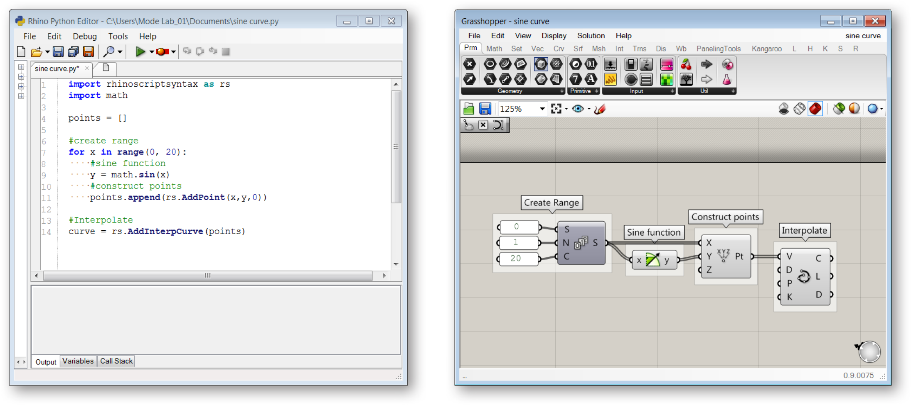

## Grasshopper - eine Uebersicht

#####Grasshopper ist ein visueller Programmeditor, der von David Rutten und Robert McNeel & Associates entwickelt wurde. Als Plug-In fuer Rhino3D, ist Grasshopper integriert in eine robuste und vielseitige Modellierungsumgebung. Diese wird von kreativen Profis across in verschiedenen Bereichen, wie z.B. Architektur, Ingenieurwissenschaften und Produktdesign genutzt. Zusammen mit Rhino bietet Grasshopper uns die Moeglichkeit praezise parametrische Beziehungen in Modellen zu definieren, die Faehigkeit generative Entwurfsablaeufe zu erkunden und eine Plattform um uebergeordnete Programmierlogik zu entwickeln – und all das in einer intuitiven, graphischen Oberflaeche.

Die Urspruenge von Grasshopper koennen bis zur Funktionalitaet des "Record History" Knopfes in Rhino3d Version 4 zurueckverfolgt werden. Dieses spezifische Merkmal erlaubte es Anwendern Modellierungsverfahren waehrend des Ablaufes implizit im Hintergrund zu speichern. Falls Du vier Kurven mit der eingeschalteten Aufzeichnungsfunktion geloftet hast, konntest Du die Kontrollpunkte der Kurven bearbeiten und die Geometrie der Flaeche wurde automatisch aktualisiert. Im Jahr 2008 hat David folgende Frage gestellt: “Was wuerde geschehen, wenn man mehr explizite Kontrolle ueber die Aufzeichnungsfunktion haette?”. Dies war der Geburtsmoment fuer den Vorlaeufer von Grasshopper - Explicit History. Diese Funktion erlaubte es die gespeicherten Arbeitsablaeufe im Detail zu bearbeiten und befaehigte den Anwender logische Sequenzen zu entwickeln, welche ueber die bestehenden Faehigkeiten von Rhino3Ds eingebaute Funktionalitaet hinausreichen. Sechs Jahre spaeter ist Grasshopper nun eine robuster, visueller  Programmiereditor, der mit verschiedenen extern entwickelten Plug-Ins erweitert werden kann. Ausserdem wurden dadurch Arbeitsablaeufe von Profis in verschiednenen Industrien grundsaetzlich veraendert und eine aktive, globale Gemeinschaft der Anwender beguenstigt.

Dieser Primer legt seinen Fokus auf die Grundlagen um Kernwissen anzubieten, das Du brauchst um in eine regelmaessige Nutzung von Grasshopper einzutauchen, sowie einige Sprungbretter fuer die naechsten Schritte in Deiner eigenen kreativen Praxis.  Bevor wir in die Beschreibungen, Diagramme und Beispiele einsteigen, welche in der Folge dargeboten werden, sollten wir darueber sprechen, was visuellen Programmierung ist, wie die Grasshopper Benutzeroberflaeche aufgebaut ist, welche grundlegenden Begriffe Grasshopper nutzt und welche "live" Eigenschaften die Rueckkopplung des Ansichtsfensters bzgl. des Benutzererlebnisses hat.

Visueller Programmierung ist ein Paradigma der Computerprogrammierung innerhalb dessen der Benutzer logische Elemente graphisch statt textbasiert manipuliert. Einige der bekanntesten text-basierten Programmiersprachen, wie C#, Visual Basic oder Processing – und naeher an zu Hause fuer Rhino – Python und Rhinoscript, verlangen von un, dass wir Code schreiben, der an sprachspezifische Syntax gebunden ist. > Im Unterschied dazu erlaubt uns visuelles programmieren funktionale Bloecke in einer Sequenz von Aktionen miteinander zu verbinden. Dabei ist die einizig benoetigte “Syntax” dass die Eingabeparameter Daten des entsprechenden Typs bekommen, und idealerweise, dass das Skript auf das beabsichtigte Resultat hin organisiert ist. Mehr dazu in den Abschnitten ueber die Abgleichung des Datenflusses und das Entwerfen mit Baumstrukturen. Diese Charakteristik des visuellen programmierens senkt die Einstiegsbarriere, welche ueblicherweise bei dem Erlernen einer neuen Sprache - auch bei einer gesprochenen - vorgefunden wird. In den Vordergrund zu stellen ist auch die graphische Benutzeroberflaeche, die Grasshopper fuer Designer in einem vertrauten Umfeld verortet.

>Dieses Bild zeigt die Entwicklung eine gezeichneten Sinuskurve in Python und Grsshopper.

Um bei Grasshopper einzusteigen und seine Faehigkeiten bezueglich visuellen programmierens nutzen zu koennen, muessen wir das Programm von der Grasshopper3D.com Webseite laden und auf unserem Computer installieren. Einmal installiert, koennen wir das das Plug-In oeffnen, indem wir “Grasshopper” in die Rhino Befehlszeile eingeben. Das erste Mal wenn wir diese Eingabe in einer neuen Rhinositzung machen, werden wir die Grasshopper Ladeanzeige sehen, bevor wir das Fenster des Grasshoppereditors sehen. Wir koenen nun funktionale Bloecke – “Komponenten” genannt- auf der “Leinwand” einfuegen, mit Kabeln verbinden und die gesamte “Definition” im .ghx Dateiformat speichern.

>Eine Grasshopperdefinition, bestehend aus Komponenten die mit Kabeln auf der Leinwand verbunden sind.

Sobald wir begonnen haben eine Grasshopperdefinition zu entwickeln und Schieberegler in unserer Leinwand erstellt haben um Geometrien zu kontrollieren, koennen wir unsere natuerliche Intuition nutzen um Verbindungen zwischen den Komponenten zu verstehen, da die Ergebnisse direkt im Rhinosansichtsfenster sichtbar werden. Die Verbindung zwischen Grasshopper und Rhino ist grundsaetzlich in Echtzeit – wenn wir einen Schieberegler veraendern, wird die Folge dieser Handlung im Rahmen der Definition ausgewertet und die Loesung neu berechnet, bevor das Ansichtsfenster aktualisiert wird. Beim Einstieg in Grasshopper ist es von Vorteil, dass die Vorschau der Geometrie, die wir sehen eine leichtgewichtige Darstellung der Loesung ist und diese automatisch aktualisiert wird. Es ist jetzt wichtig zu wissen, dass sobald Deine Definitionen komplexer werden und auf geschickte Art und Weise den Datenfluss regeln, das Rhinoansichtsfenster den Status der Rechnerloesung wiederspiegeln, um ungewollte Kopfschmerzen zu vermeiden.

>Programmfluss von links nach rechts.

####MERKPUNKTE
* Grasshopper ist ein grafischer Algorithmeneditor, der in das Rhino3D Modellierwerkzeug integriert ist.
* Algorithmen sind schrittweise Prozeduren, die entworfen wurden um eine bestimmte Operation durchzufuehren.
* Du benutzt Grasshopper um Algorithmen zu entwerfen, die dann Aufgaben in Rhino3D automatisieren.
* Ein einfacher Weg um einzusteigen, wenn Du Dir nicht sicher bist, wie eine bestimmte Operation in Grasshopper ausgefuehrt werden kann, waere es den Algorithmus haendisch und schrittweise mit Rhinobefehlen zu erarbeiten.

Sobald Du erstmals beginnst Grasshopper zu erkunden oder Deine Faehigkeiten weiter entwickelst, bist Du ein Teil der weltweiten Grasshoppergemeinschaft. Diese Gemeinschaft besteht aus aktiven Mitgliedern aus vielen verschiedenen Anwendungsgebieten und vielfaeltigen Erfahrungsniveaus. Das Forum auf Grasshopper3D.com ist eine nuetzliche Quelle um Fragen zu stellen, Ergebnisse zu teilen und Wissen zu sammeln. Diese Gemeinschaft hat uns waehrend des Schreibens des Primers sehr geholfen und wir haben uns daran erfreut, wie sich Grasshopper ueber die Jahre entwickelt hat.
Herzlich Willkommen!
