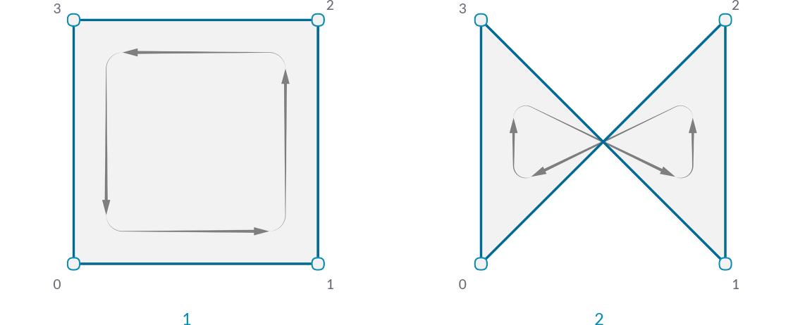
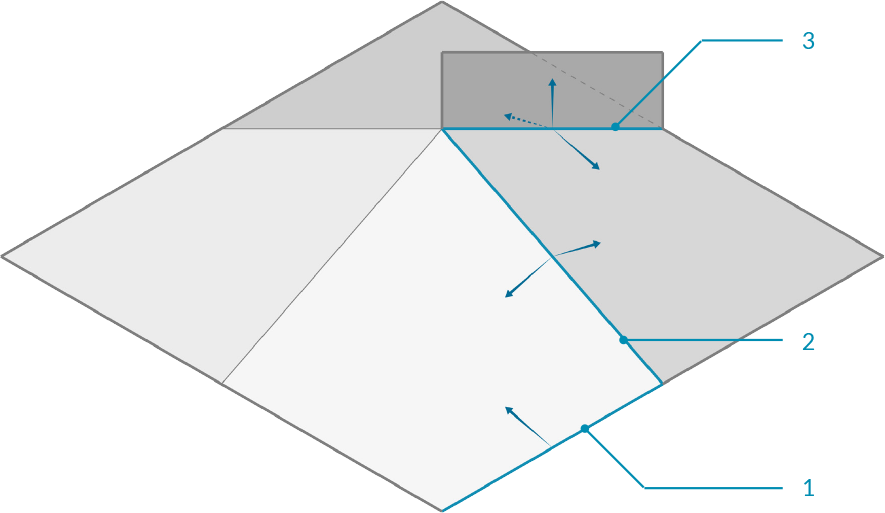
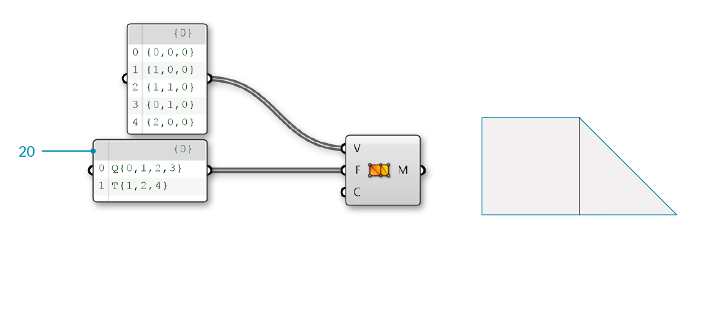

### 1.6.1 What is a Mesh?

#####A Mesh is a collection of quadrilaterals and triangles that represents a surface or solid geometry. This section discusses the structure of a mesh object, which includes vertices, edges, and faces, as well as additional characterstics such as colors and normals that can be used to refine a mesh.

>1. Mesh vertices
2. Mesh edges
3. Mesh faces

####1.6.1.1 Basic Anatomy of a Mesh

What is the minimum amount of information needed to define a mesh? Grasshopper defines meshes using a Face-Vertex data structure. At its most basic, this structure is simply a collection of points which are grouped into polygons. The points of a mesh are called *vertices*, while the polygons are called *faces*. To create a mesh we need a list of vertices and a system of grouping those vertices into faces.

>1. A list of vertices
2. Faces with groupings of vertices

**Vertices**

The vertices of a mesh are simply a list of points. Recall that in Grasshopper, a *list* is a collection of objects and each object in the list has an *index* which describes that objects position in a list. The index of the vertices is very important when constructing a mesh, or getting information about the structure of a mesh.

>1. A list of points in Grasshopper
2. The set of points labeled with their index

**Faces**

A face is an ordered list of three or four vertices. The “surface” representation of a mesh face is therefore implied according to the position of the vertices being indexed. We already have the list of vertices that make up the mesh, so instead of providing individual points to define a face, we instead simply use the index of the vertices. This also allows us to use the same vertex in more than one face.

>1. A Quad Face made with indices 0, 1, 2, and 3
2. A Triangle Face made with indices 1, 4, and 2

In Grasshopper, faces can be created with the **Mesh Triangle** and **Mesh Quad** components. The input for these components are integers that correspond to the index of the vertices we want to use for a face. By connecting a **Panel** to the output of these components, we can see that a triangular face is represented as T{A;B;C}, and a quad face as Q{A;B;C;D}. 

>1. **Mesh Quad** component with indices 0, 1, 2, and 3
2. **Mesh Triangle** component with indices 1, 4, and 2

These components have not yet created a mesh, but have simply defined a list of indices. By paying attention to the format of this list, we can also create a face manually by editing a **Panel** component and entering the appropriate format for either triangular or quad faces.

>1. A face created using a **Mesh Quad** component
2. A face created using a **Panel**
3. A Panel Properties window is automatically opened when double-clicking a panel while zoomed out, or by right-clicking a panel and selecting "Edit Notes..."

So far we have a list of vertices and a set of face definitions, but have not yet created a mesh. In order to create a mesh, we need to connect the faces and vertices together by using the **Construct Mesh** component. We connect our list of vertices to the V input, and a merged list of faces to the F input. (The component also has room for an optional Color input, which is discussed below.) If we connect a panel to the output of the **Construct Mesh** we can see information about the number of faces and number of indices.

>1. The **Construct Mesh** component takes a list of vertices and a list of faces as input. The Color input is optional, and is left blank for now
2. A panel shows that we have created a mesh with 5 vertices and 2 faces
3. The resulting mesh (the vertices have been labeled with their indices)

By default, Grasshopper only previews the surfaces of mesh geometry without displaying the edges. To preview the edges as well as the surfaces, you can turn on mesh edge preview by using the shortcut Ctrl-M, or by going to the Display menu and selecting 'Preview Mesh Edges'.

It is extremely important to pay attention to the order of the indices when constructing a mesh face. The face will be constructed by connecting the vertices listed in order, so the quad face Q{0,1,2,3} and Q{1,0,2,3} are very different, despite using the same four vertices. Incorrect vertex ordering can lead to problems such as holes, non-manifold mesh geometry, or non-orientable surfaces. These issues are discussed in more detail in the **Understanding Topology** section.

>1. A quad face with indices 0,1,2,3
2. A quad with indicies 0,3,1,2

####1.6.1.2 Implicit Mesh Data

In addition to faces and vertices, there is other information about a mesh that we will want to use. In a Face-Vertex based mesh, data such as edges and normals are calculated implicitly based on the given faces and vertices. This section describes ways to query this information.

**Edges**

The Edges of a Mesh are lines connecting any two consecutive vertices in a face. Notice that some edges are shared between multiple faces, while other edges are only adjacent to one face. The number of faces an edge is adjacent to is called the *Valence* of that edge.

Grasshopper groups edges into three categories based on the valence:

1. E1 - 'Naked Edges' have a valence of 1. They make up the external boundary of a mesh.
2. E2 - 'Interior Edges' have a valence of 2. 
3. E3 - 'Non-Manifold Edges' have a valence of 3 or greater. Meshes that contain such structure are called "Non-Manifold", and are discussed in the next section.

>1. Naked edge with valence of 1
2. Interior edge with valence of 2
3. Non-manifold edge with valence of 3

We can use the **Mesh Edges** component to get the edges of a mesh outputted according to valence. This allows us to locate edges along the boundary of a mesh, or to identify non-manifold edges. Sometimes, however, it is more useful to have the full boundary of each face. For this, we can use the **Face Boundaries** component. This will return a polyline for each face.

>1. A **Mesh Edges** component outputs three sets of edges. This mesh has 5 naked edges, 1 interior edge, and zero non-manifold edges
2. The E3 output is empty, because this mesh does not have any non-manifold edges, resulting in an orange wire.
3. A **Face Boundaries** component outputs one polyline for each face

**Face Normals**

In the case of triangular faces, we know that any three points must be planar, so the normal will be perpendicular to that plane, but how do we know which direction ('up' or 'down') the normal will be pointing? Once again, the *order* of the indicies is crucial here. Mesh faces in Grasshopper are defined counter-clockwise, so a face with indices {0,1,2} will be 'flipped' as compared to the indicies {1,0,2}. Another way to visualize this is to use the *Right-Hand-Rule*. 

>1. The **Face Normals** component will return a list of center points and normal vectors for each face
2. Face normals according to vertex sequence
3. "Right-Hand-Rule" for determining normal direction

Grasshopper also allows quad faces, in which case the 4 points will not always be planar. For these faces, the center point will be simply the average of the coordinates of the 4 vertices (in the case of a non-planar quad, note that this point is not necessarily on the mesh). To calculate the normal of a quad face, we need to first trianglulate the quad by splitting it into two planar triangles. The normal of the overall face is then the average of the two normals, weighted according to the area of the two triangles.

**Vertex Normals**

In addition to the face normals, it is also possible to calculate normals for each vertex of a mesh. For a vertex that is only used in a single face, the normal at the vertex will be equal to the normal of the face. If a vertex has multiple adjacent faces, the vertex normal is calculated by taking the average of the faces. While less intuitive than face normals, vertex normals are important for smooth visualization of meshes. You might notice that even though a triangulated mesh is composed of planar facets, such a mesh can still appear smooth and rounded when shaded in Rhino. Using the vertex normals allows this smooth visualization.

>1. Normals set according to the face normal results in discrete polygonal shading
2. Adjancent face normals are averaged together to create vertex normals, resulting in smooth shading across faces

####1.6.1.3 Mesh Attributes

Meshes can also be assigned additional attributes to either vertices or faces. The simplest of these is vertex color, which is described below, but other attributes exist such as texture UV coordinates. (Some programs even allow vertex normals to be assigned as attributes instead of being derived from the faces and vertices, which can provide even more flexibility in rendered surface appearance.)

**Color**

When using a **Construct Mesh** component, there is an option input for vertex color. Colors can also be assigned to an existing mesh using the **Mesh Color** component. By using a single color for a mesh, we can color the entire mesh.

>Trianglular mesh objects colored with red, green, or blue

While the above examples colored the entire mesh, color data are actually assigned for each vertex. By using a list of three colors, we can color each vertex in the triangle separately. These colors are used for visualitizations, with each face rendered as an interpolation of the vertex colors. For example, the image below shows triangle face with vertex colors of Red, Green, and Blue.

>1. Red, green, and blue are assigned to the three vertices of a mesh
2. The resulting mesh interpolates the colors of the vertices

####1.6.1.4 Exercise

>Example files that accompany this section: [http://grasshopperprimer.com/appendix/A-2/1_gh-files.html](http://grasshopperprimer.com/appendix/A-2/1_gh-files.html)

>Example files that accompany this section: [Download](../../appendix/A-2/gh-files/1.6.1_what is a mesh.gh)


||||
|--|--|--|
|01.| Start a new definition, type Ctrl-N (in Grasshopper)||
|02.| **Mesh/Primitive/Mesh Quad** - Drag and drop a **Mesh Quad** component onto the canvas||
|03.| **Mesh/Primitive/Construct Mesh** - Drag and drop a **Construct Mesh** component onto the canvas|
|04.| Connect the Face (F) output of the **Mesh Quad** component to the Faces (F) input of the **Construct Mesh** component|||

> **Mesh Quad** and **Construct Mesh** have default values which create a single mesh face. Next, we will replace the default values with our own vertices and faces.

||||
|--|--|--|
|05.| **Params/Input/Panel** - Drag and drop a **Panel** component onto the canvas||
|06.| Double-click the **Panel** component and set the value to '0'||
|07.| **Params/Input/Panel** - Drag and drop four more **Panel** components onto the canvas and set their values to 1,2,3, and 4   <blockquote>You can also copy the original **Panel** by clicking and dragging, then tapping the Alt key before releasing the click</blockquote>||
|08.| Connect the **Panels** to the inputs of the **Mesh Quad** in the following order:<ul>0 - A 1 - B 2 - C 3 - D</ul>||
|09.| **Mesh/Primitive/Mesh Triangle** - Drag and drop a **Mesh Triangle** component onto the canvas||
|10.| Connect the **Panels** to the inputs of the **Mesh Triangle** component in the following order: <ul>1 - A 2 - B 4 - C</ul>||
|11.| **Sets/Tree/Merge** - Drag and drop a **Merge** component onto the canvas||
|12.| Connect the Face (F) output of the **Mesh Quad** component to the Data1 (D1) input of the **Merge** component, and the Face (F) output of the **Mesh Triangle** component to the Data2 (D2) input of the **Merge** component||
|13.| Connect the Result (R) output of the **Merge** component to the Faces (F) input of the **Construct Mesh** component|||

>The default Vertices list of **Construct Mesh** only has 4 points, but the **Mesh Triangle** component uses an index of 4, which would correspond to the fifth point in a list. Since there are not enough vertices, the **Construct Mesh** component gives an error. To fix it, we will provide our own list of points.

||||
|--|--|--|
|14.| **Params/Input/Panel** - Drag and drop a **Panel** component onto the canvas||
|15.| Right-click the **Panel** component and de-select the 'Multiline Data' option  <blockquote>By default, a panel has 'Multiline Data' enabled. By disabling it, each line in the panel will be read as a separate item within a list.</blockquote>||
|16.| Double-click the **Panel** component to edit it, and enter the following points: <ul>{0,0,0} {1,0,0} {1,1,0} {0,1,0} {2,0,0}</ul><blockquote>Make sure you use the correct notation. To define a point in a **Panel**, you have to use curly brackets: '{' and '}' with commas between the x, y, and z values</blockquote>||
|17.| Connect the **Panel** component to the Vertices (V) input of the **Construct Mesh** component|||

>We now have a mesh with two faces and 5 vertices.  

Optionally, we can replace the **Mesh Quad** and **Mesh Triangle** components with a panel specifying the indices of the faces.

||||
|--|--|--|
|18.|**Params/Input/Panel** - Drag and drop a **Panel** component onto the canvas||
|19.|Right-click the **Panel** component and deselect 'Multiline Data'   <blockquote>Alternatively, copy the existing **Panel** that we used for the points, which already has 'Multiline Data' disabled</blockquote>||
|20.|Double-click the **Panel** component to edit it, and enter the following: <ul>Q{0,1,2,3} T{1,2,4}</ul>||
|21.|Connect the **Panel** to the Faces (F) input of the **Construct Mesh** component|||

||||
|--|--|--|
|22.| **Params/Input/Colour Swatch** - Drag and drop a **Colour Swatch** component onto the canvas||
|23.| Click the colored section of the component (the default is White) to open the color selection panel||
|24.| Use the sliders to set the G and B values to zero. The swatch should now be Red||
|25.| **Params/Input/Colour Swatch** - Drag and drop two more **Colour Swatch** components onto the canvas and set their colors to Blue and Green||
|26.| **Sets/Tree/Merge** - Drag and drop a **Merge** component onto the canvas||
|27.| Connect the three **Color Swatch** components into the D1, D2, and D3 inputs of the **Merge** component.||
|28.| Connect the Result (R) output of the **Merge** component to the Colours (C) input of the **Construct Mesh** component|||

>We have 5 vertices, but only 3 colors. Grasshopper will assign the colors in a repeating pattern, so in this cases vertices 0 and 3 will be Red, vertices 1 and 4 will be Green, and the final vertex 2 will be Blue.

