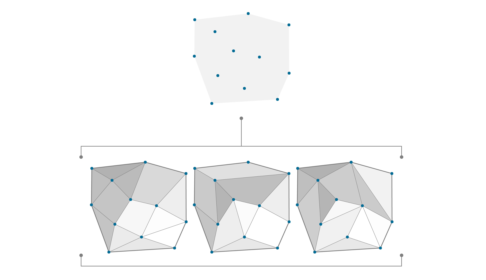
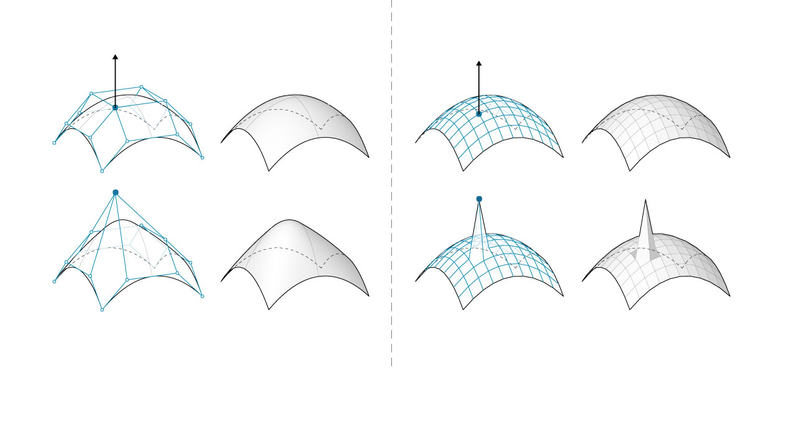

### 1.6.2 Understanding Topology

#####While the vertices of a mesh contain position information, it is really the connections between the vertices that give a mesh geometry its unique structure and flexibility. 

#### 1.6.2.1 What is Topology?

Any introduction to mesh geometry would be incomplete without at least a basic introduction to topology. Because topology is concerned with the inter-relationships and properties of a set of “things” rather than the “things” themselves, it is mobilized for an enormous range of both tangible and intangible applications. In this primer, we are interested in its basic application with respect to parametric workflows that afford us the opportunity to create and control mesh geometry.

In Grasshopper, the two basic types of information required to define a mesh are geometry and connectivity; in other words, a set of points in rhino-space (vertices) and set of corresponding point-associations (faces).

Without connectivity information, a mesh is unstructured and therefore still undefined. The introduction of a set of faces is the step (or leap) that ultimately actualizes a mesh and establishes its character in terms of continuity, convergence, and connectedness; this structural network is referred to as a *topological space*.

>The same set of vertices can have different connectivity information, resulting in different topology.

**Homeomorphism**

>The points of a mesh can be moved without altering the connectivity information. The new mesh has the same topology as the original.

It is possible for two distinct mesh shapes to be topologically identical. All this would mean is that they are constructed out of the same number of points and that the points are structured by the same set of faces. Earlier, we established that a mesh face is only concerned with the indices of a set of points and has no interest in their actual location in rhino-space. Therefore, if the only difference between two distinct mesh shapes is the specific 3-dimentional position of the points that are used to define it, then the two meshes are considered to be “homeomorphic” (or topologically equivalent) and therefore share the same topological properties.

>An example of homeomorphism among letters (note that some of the above homeomorphic groups might be different depending on what font is considered)

>A mug and a donut are topologically equivalent
 
 
####1.6.2.2 Mesh Characteristics

**Orientable**

A mesh is considered *orientable* if there are well-defined sides to the mesh. An simple example of a non-orientable mesh occurs when adjacent faces have normals pointing in opposite directions. These 'flipped faces' can cause problems in visualizations and renderings, as well as manufacturing or 3D-printing.

>1. An orientable surface with face normals pointing in the same direction.
2. A non-orientable surface has adjacent normals pointing in different directions. 

**Open vs Closed**

It is often necessary to know whether a mesh is a *closed* mesh which represents a volumetric solid, or an *open* mesh that just represents a 2-dimensional surface. The difference can be imperative with respect to manufacturability. You cannot 3D print a single surface which has no thickness, but must instead thicken the mesh so that it is a solid. Solid mesh geometry is also required for Boolean operations (discussed in following section). 

The **Mesh Edges** component can be used to help determine this. If none of the edges of a mesh have a valence of 1 (if the E1 output is *null*), then we know that all the edges are 'Interior Edges' and the mesh does not have an external boundary edge, and is therefore a closed mesh.

On the other hand, if there exist 'Naked Edges', then those edges must be on a boundary of the mesh, and the mesh is not closed.

>1. A closed mesh. All edges are adjacent to exactly two faces.
2. An open mesh. The white edges are each adjacent to only a single face.

**Manifold vs Non-Manifold**

Non-manifold geometry is essentially geometry that cannot exist in the "real world". This does not necessarily make it "bad geometry" but it is something to be aware of due to complications it may present for tools and operations (for example: rendering of refractive effects, fluid simulations, boolean operations, 3d printing, etc). Common conditions that result in a non-manifold mesh include: self intersection, naked edges (from holes or internal faces), disjoint topology, and overlapping/duplicate faces. A mesh can also be considered *Non-Manifold* if it includes any vertices which are shared by faces that do not share edges or any edges with a valence greater than 2, creating a junction of at least 3 faces

>1. A simple manifold mesh
2. Three faces meeting on a single edge is non-manifold, also known as a T-Junction
3. Two faces meeting at only one vertex but not sharing an edge is non-manifold

 
#### 1.6.2.3 Meshes Vs NURBs

How is mesh geometry different from NURBs geometry? When might you want to use one instead of the other? 

#####Parameterization
In a previous chapter, we saw that NURBs surfaces are defined as a series of NURBs curves going in two directions. These directions are labeled U and V, and allow a NURBs surface to be parameterized according to a two-dimensional surface domain. The curves themselves are stored as equations in the computer, allowing the resulting surfaces to be calculated to an arbitarily small degree of precision. It can be difficult, however, to combine multiple NURBS surfaces together. Joining two NURBS surfaces will result in a polysurface, where different sections of the geometry will have different UV parameters and curve definitions.

Meshes, on the other hand, are comprised of a discrete number of exactly defined vertices and faces. The network of vertices generally cannot be defined by simple UV coordinates, and because the faces are discrete the amount of precision is built into the mesh and can only be changed by refining the mesh and added more faces. The lack of UV coordinates, however, allows meshes the flexibility to handle more complicated geometry with a single mesh, instead of resorting to a polysurface in the case of NURBS.

>Note - While a mesh does not have implicit UV parameterization, it is sometimes useful to assign such a parameterization in order to map a texture or image file onto mesh geometry for rendering. Some modeling software therefore treats the UV coordinates of a mesh vertex as an *attribute* (like vertex color) which can be manipulated and changed. These are usually assigned and not completely defined by the mesh itself.

#####Local vs Global Influence

Another important difference is the extent to which a local change in mesh or NURBS geometry affects the entire form. Mesh geometry is completely local. Moving one vertex affects only the faces that are adjacent to that vertex. In NURBS surfaces, the extent of the influence is more complicated and depends on the degree of the surface as well as the weights and knots of the control points. In general, however, moving a single control point in a NURBS surface creates a more global change in geometry.

>1. NURBS Surface - moving a control point has global influence
2. Mesh geometry - moving a vertex has local influence

One analogy that can be helpful is to compare a vector image (composed of lines and curves) with a raster image (composed of individual pixels). If you zoom into a vector image, the curves remain crisp and clear, while zooming into a raster image results in seeing individual pixels. In this analogy, NURBS surfaces can be compared to a vector image, while a mesh behaves similarly to a raster image.

It is interesting to note that while NURBs surfaces are stored as mathematical equations, the actual visualization of these surfaces requires meshes. It is not possible for a computer to display a continuous equation. Instead, it must break that equation down into smaller parts, the result of which is that all rendering or display processing must convert NURBS to meshes. As an analogy, consider that even though we can store the equation of a line on a computer, in order to display that line, the computer must at some point convert the line into a series of discrete pixels on a screen to display. 

#### 1.6.2.4 Pros and Cons of Meshes

When we ask “What are the pros and cons of modeling with meshes?” we are really asking “What are the pros and cons of modeling with shapes that are defined solely by a set of vertices and a corresponding topological framework?” Through this method of framing the question it is easier to see how the “simplistic” nature of a mesh is the critical aspect that would make a mesh either favorable or unfavorable to model with depending on the context of its application.

Meshes can be favorable in situations where:

- There must be a dynamically updated rendering of a form that is changing in shape but not in face connectivity
- A discretized approximation of a curved geometry would suffice
- A low-resolution geometry must be systematically smoothed (or articlated) using computational methods to arrive at a higher-resolution model.
- The low resolution model must be able to be to simultaneously support local, high resolution detail

Meshes can be unfavorable in situations where:

- Curvature and smoothness must be represented with a high level of precision
- True derivatives must be evaluated
- The geometry must be converted into a manufacturable solid
- The final form must be able to be easily edited manually

 

