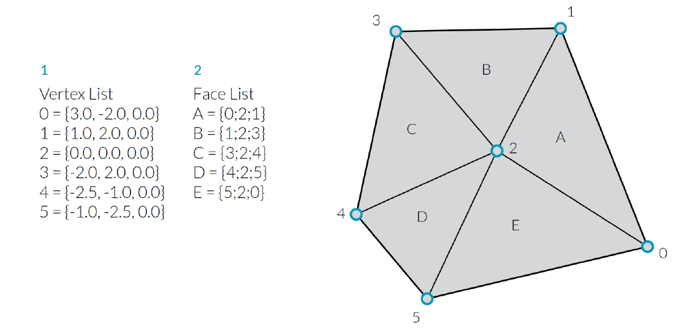
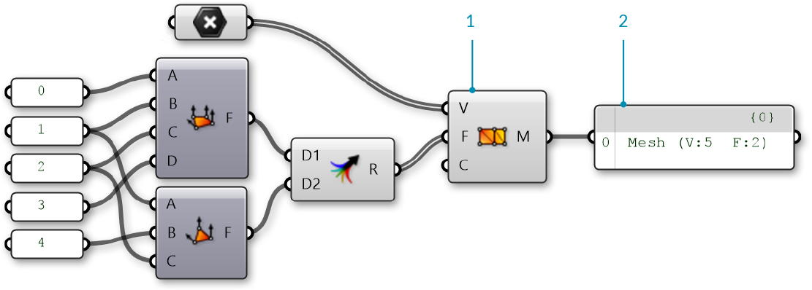
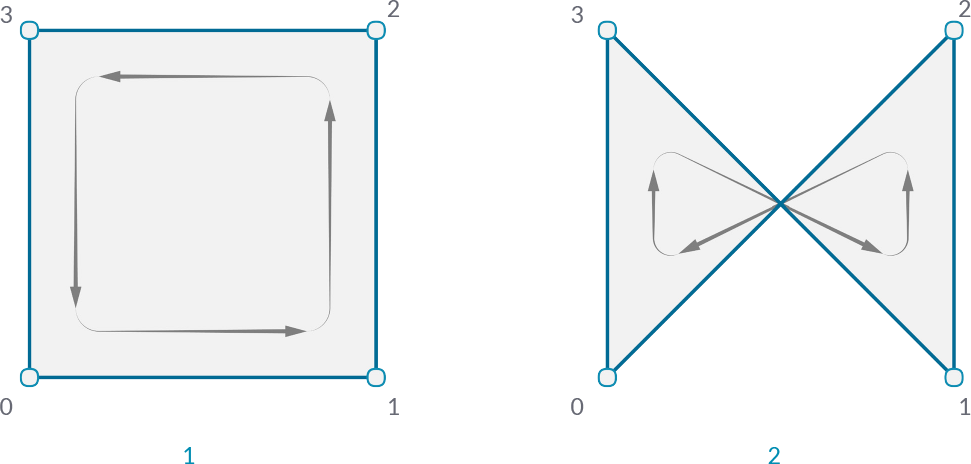
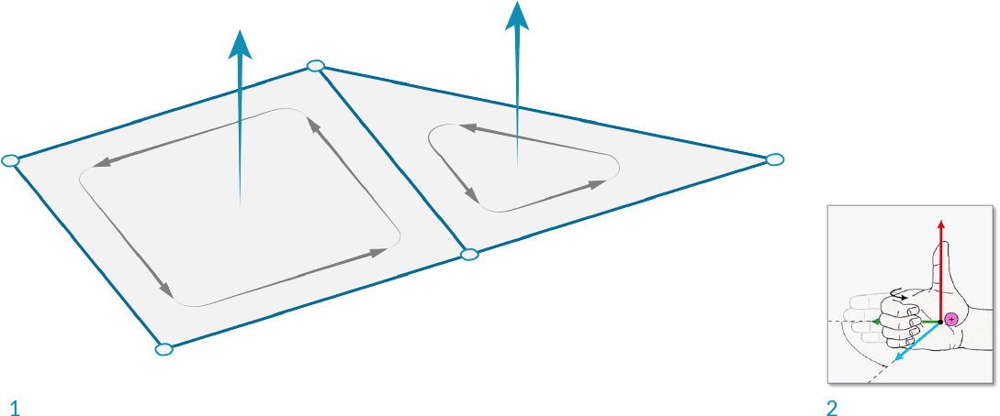
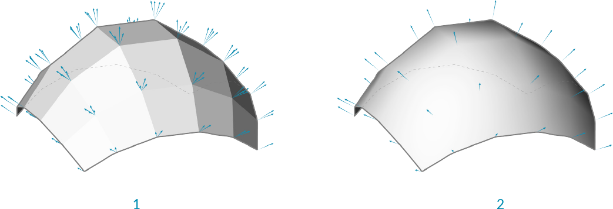
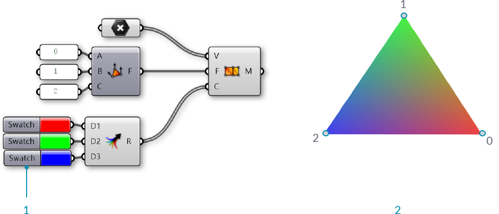

## 1.6.2 What is a Mesh?

#####A Mesh is a collection of quadrilaterals and triangles that represents a surface or solid geometry. This section discusses the structure of a mesh object, which includes vertices, edges, and faces, as well as additional characterstics such as colors and normals that can be used to refine a mesh.

>1. Mesh vertices
2. Mesh edges
3. Mesh faces

####1.6.2.1 Basic Anatomy of a Mesh

Grasshopper defines meshes using a Face-Vertex data structure. At its most basic, this structure is simply a collection of points which are grouped into polygons. The points of a mesh are called *vertices*, while the polygons are called *faces*. To create a mesh, then, we need a list of vertices, and a system of grouping those vertices into faces.

>1. A list of vertices
2. Faces with groupings of vertices

**Vertices**

The vertices of a mesh are simply a list of points. Recall that in Grasshopper, a *list* is a collection of objects and each object in the list has an *index* which describes that objects position in a list. The index of the vertices is very important when constructing a mesh, or getting information about the structure of a mesh.

>1. A list of points in Grasshopper
2. The set of points labeled with their index

**Faces**

A face is created by specifying an ordered list of either three or four vertices. We already have the list of vertices that make up the mesh, so instead of providing individual points to define a face, we instead simply use the index of the vertices. This also allows us to use the same vertex in more than one face.

>1. A Quad Face made with indices 0, 1, 2, and 3
2. A Triangle Face made with indices 1, 4, and 2

In Grasshopper, faces can be created with the **Mesh Triangle** and **Mesh Quad** components. The input for these components are integers that correspond to the index of the vertices we want to use for a face. By connecting a **Panel** to the output of these components, we can see that a triangular face is represented as T{A;B;C}, and a quad face as Q{A;B;C;D}. 

>1. **Mesh Quad** component with indices 0, 1, 2, and 3
2. **Mesh Triangle** component with indices 1, 4, and 2

These components have not yet created a mesh, but have simply defined a list of indices. By paying attention to the format of this list, we can also create a face manually by editing a **Panel** component and entering the appropriate format for either triangular or quad faces.

>1. A face created using a **Mesh Quad** component
2. A face created using a **Panel**

So far we have a list of vertices and a set of face definitions, but have not yet created a mesh. In order to create a mesh, we need to connect the faces and vertices together by using the **Construct Mesh** component. We connect our list of vertices to the V input, and a merged list of faces to the F input. (The component also has room for an optional Color input, which is discussed below.) If we connect a panel to the output of the **Construct Mesh** we can see information about the number of faces and number of indices.

>1. The **Construct Mesh** component takes a list of vertices and a list of faces as input. The Color input is optional, and is left blank for now
2. A panel shows that we have created a mesh with 5 vertices and 2 faces

It is extremely important to pay attention to the order of the indices when constructing a mesh face. The face will be constructed by connecting the vertices listed in order, so the quad face Q{0,1,2,3} and Q{1,0,2,3} are very different, despite using the same four vertices.

>1. A quad face with indices 0,1,2,3
2. A quad with indicies 0,3,1,2

####1.6.2.2 Implicit Mesh Data

In addition to faces and vertices, there is other information about a mesh that we will want to use. In a Face-Vertex based mesh, data such as edges and normals are calculated implicitly based on the given faces and vertices. This section describes ways to query this information.

**Edges**

The Edges of a Mesh are lines connecting any two consecutive vertices in a face. Notice that some edges are shared between multiple faces, while other edges are only adjacent to one face. The number of faces an edge is adjacent to is called the *Valence* of that edge.

We can use the **Mesh Edges** component to get the edges of a mesh. Notice that the mesh edges are split into three categories:

1. E1 - 'Naked Edges' have a valence of 1. They make up the external boundary of a mesh.
2. E2 - 'Interior Edges' have a valence of 2. 
3. E3 - 'Non-Manifold Edges' have a valence of 3 or greater. Meshes that contain such structure are called "Non-Manifold", and are discussed in more detail below.

>1. Naked edge with valence of 1
2. Interior edge with valence of 2
3. Non-manifold edge with valence of 3

Sometimes it is more useful to have the full boundary of each face. For this, we can use the **Face Boundaries** component. This will return a polyline for each face.

>1. A **Mesh Edges** component outputs three sets of edges. This mesh has 5 naked edges, 1 interior edge, and zero non-manifold edges
2. A **Face Boundaries** component outputs one polyline for each face

**Face Normals**

In the case of triangular faces, we know that any three points must be planar, so the normal will be perpendicular to that plane, but how do we know which direction ('up' or 'down') the normal will be pointing? Once again, the *order* of the indicies is crucial here. Mesh faces in Grasshopper are defined counter-clockwise, so a face with indices {0,1,2} will be 'flipped' as compared to the indicies {1,0,2}. Another way to visualize this is to use the *Right-Hand-Rule*. 

>1. Face normals according to vertex sequence
2. "Right-Hand-Rule" for determining normal direction

The **Face Normals** component will return a list of center points and normals for each face.

Grasshopper also allows quad faces, in which case the 4 points will not always be planar. For these faces, the center point will be simply the average of the coordinates of the 4 vertices (in the case of a non-planar quad, note that this point is not necessarily on the mesh). To calculate the normal of a quad face, we need to first trianglulate the quad by splitting it into two planar triangles. The normal of the overall face is then the average of the two normals, weighted according to the area of the two triangles.

**Vertex Normals**

In addition to the face normals, it is also possible to calculate normals for each vertex of a mesh. For a vertex that is only used in a single face, the normal at the vertex will be equal to the normal of the face. If a vertex has multiple adjacent faces, the vertex normal is calculated by taking the average of the faces. While less intuitive than face normals, vertex normals are important for smooth visualization of meshes. You might notice that even though a triangulated mesh is composed of planar facets, such a mesh can still appear smooth and rounded when shaded in Rhino. Using the vertex normals allows this smooth visualization.

>1. Normals set according to the face normal results in discrete polygonal shading
2. Adjancent face normals are averaged together to create vertex normals, resulting in smooth shading across faces

####1.6.2.3 Mesh Attributes

Meshes can also be assigned additional attributes to either vertices or faces. The simplest of these is vertex color, which is described below, but other attributes exist such as texture UV coordinates. (Some programs even allow vertex normals to be assigned as attributes instead of being derived from the faces and vertices, which can provide even more flexibility in rendered surface appearance.)

**Color**

When using a **Construct Mesh** component, there is an option input for vertex color. Colors can also be assigned to an existing mesh using the **Mesh Color** component. These colors are used for visualitizations, with each face rendered as an interpolation of the vertex colous. For example, the image below shows triangle face with vertex colors of Red, Green, and Blue.

>1. Red, green, and blue are assigned to the three vertices of a mesh
2. The resulting mesh interpolates the colors of the vertices

####1.6.2.4 Mesh Characteristics

**Open vs Closed**

It is often necessary to know whether a mesh is a *closed* mesh which represents a volumetric solid, or an *open* mesh that is just represents a 2-dimensional surface. The difference can be imperative with respect to manufacturability and boolean operations (discussed in following section). The **Mesh Edges** component can be used to help determine this. If none of the edges of a mesh have a valence of 1 (if the E1 output is *null*), then we know that all the edges are 'Interior Edges' and the mesh does not have an external boundary edge, and is therefore a closed mesh.

On the other hand, if there exist 'Naked Edges', then those edges must be on a boundary of the mesh, and the mesh is not closed.

>1. A closed mesh. All edges are adjacent to exactly two faces.
2. An open mesh. The white edges are each adjacent to only a single face.

**Manifold vs Non-Manifold**

Non-manifold geometry is essentially geometry that cannot exist in the "real world". This does not necessarily make it "bad geometry" but it is something to be aware of due to complications it may present for tools and operations (for example: rendering of refractive effects, fluid simulations, boolean operations, 3d printing, etc). Common conditions that result in a non-manifold mesh include: self intersection, naked edges (from holes or internal faces), disjoint topology, and overlapping/duplicate faces. A mesh can also be considered *Non-Manifold* if it includes any vertices which are shared by faces that do not share edges or any edges with a valence greater than 2, creating a junction of at least 3 faces

####1.6.2.5 Exercise

In this exercise, we use a basic Mesh primitive, perform a transformation on the vertices, and then assign a color based on the normal vectors to approximate the rendering process.

EXERCISE