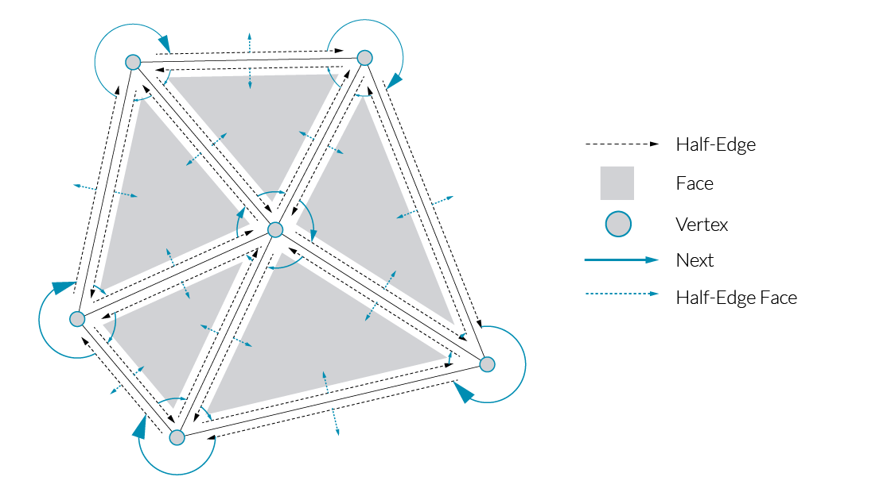
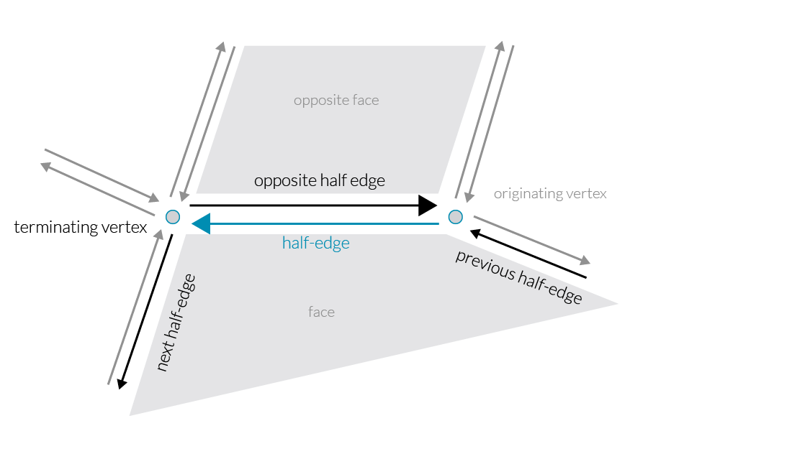
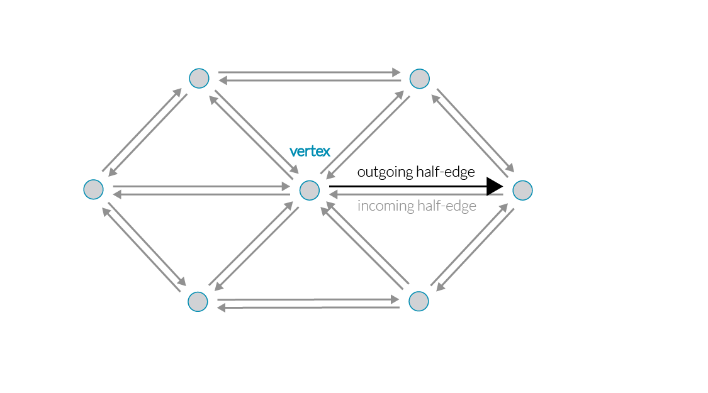

###2.1.2 Half Edge Data

In the Grasshopper primer, we looked at how Grasshopper defines a mesh using a Face-Vertex data structure. This is a relatively simple data structure and is widely used in applications that use meshes, but can be computationally inefficient for more advanced algorithms. The Element\* add-on restructures the mesh using Half-Edge data, an edge-centered data structure, which allows for efficient queries of adjacent vertices, faces, and edges, which can vastly improve on algorithm speed and performance. This structure is capable of maintaining incidence information of vertices, edges and faces. This method facilitates the creation of new patterns and geometries all based on the topological relationship of the base geometry.

The half-edge data structure is a representation for a mesh in which each edge is split up into two half-edges with opposite directions. This allows explicit and implicit access to data from one mesh element to adjacent elements.

####2.1.2.1 Half-Edge Connectivity
The half-edge highlighted in blue explicitly stores indices to its termination point, adjacent half-edges, and the face it belongs to. The other information (gray) can be accessed implicitly.

####2.1.2.2 Vertex Connectivity
The vertex highlighted in blue explicitly stores an index to one of its outgoing half-edges. The other information (gray) can be accessed implicitly.

