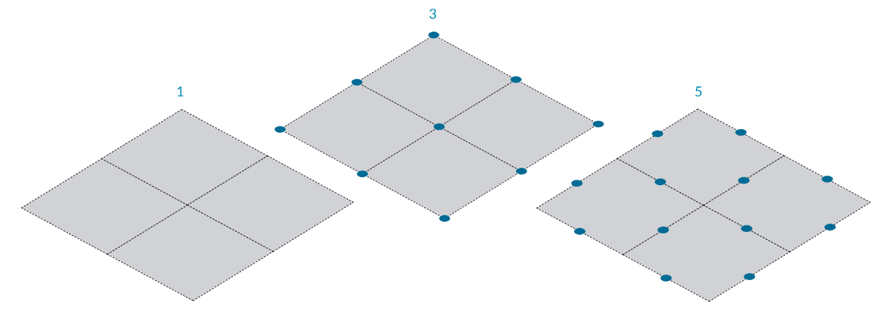
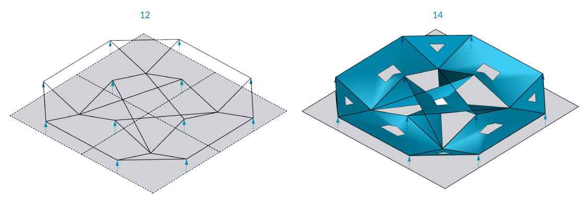
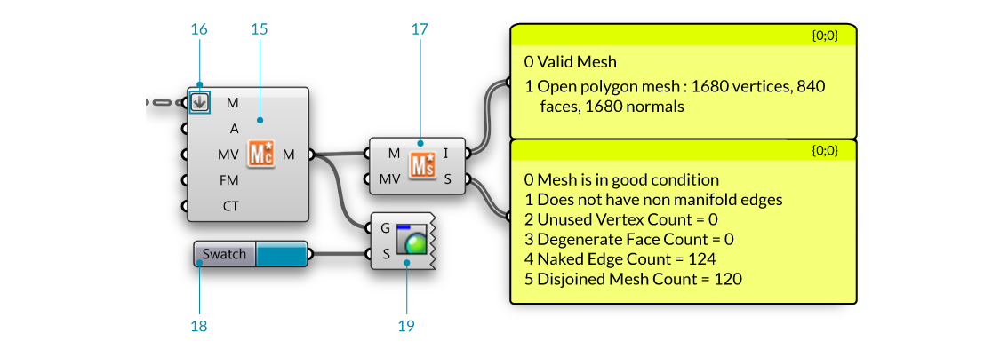
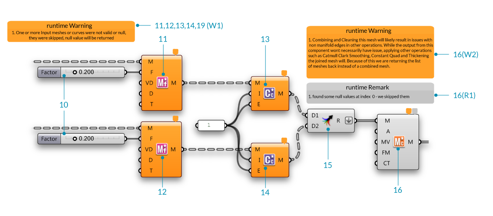

### 2.1.4 Element* Architectural Case Study 

#####In this section, we will work through a simple exercise file for producing architectural facades. The case studies will be broken down into 3 Phases with this being Phase 1. Phase 2 and 3 will come at a later time. This example incorporates Half Edge data structures along with basic Element* components without the use of per vertex features.

####2.1.4.1 Example 1


>Example files that accompany this section: [http://grasshopperprimer.com/appendix/A-2/1_gh-files.html](http://grasshopperprimer.com/appendix/A-2/1_gh-files.html)

>Example files that accompany this section: [Download](../../appendix/A-2/gh-files/2.1_element addon.gh)


---

---

||||
|--|--|--|
|00.| Create a meshplane in Rhino with **XFaces = 2 & YFaces==2** and Start a new definition, type Ctrl-N (in Grasshopper)||
|01.| **Params/Geometry/Mesh** - Drag and drop a **Mesh** container onto the canvas||
|01.| Reference a mesh in Rhino by right-clicking the **Mesh** component and selecting "Set one Mesh".   <blockquote>We are going to use a simple mesh plane to walk through the definition, feel free to swap out the mesh with your own mesh</blockquote>||
|02.| **Element\*/Utility/Mesh Combine and Clean** - Drag and drop a **Mesh Combine and Clean** component on the canvas||
|03.| **Element\*/Data/Vertex Neighbors** - Drag and drop the **Element* Vertex Neighbors** component onto the canvas| |
|04.| **Params/Input/Number Slider** - Drag and drop a **Number Slider** component onto the canvas and set the following values: <ul>Lower Limit: 0.0000 Upper Limit: 1.0000</ul>||
|05.| **Curve/Analysis/Evaluate Curve** - Drag and drop a **Evaluate Curve** container onto the canvas||
|05b.| Connect the Neighbouring Edges (NE) output of the **Element* Vertex Neighbors** component to the Curve (C) input of the **Evaluate Curve** component||
|05c.| Connect the **Number Slider** to the Float (t) input of the **Evaluate Curve** component||
|05d.| Right click the Curve (C) input of the **Evaluate Curve** component and enable **Reparameterize** |||

---
>Looking at the data of the Neighboring Face Edges (NE) output, we see that we have a tree with 20 branches, where each branch contains three lines. The 20 branches each represent a face of the icosohedron which has 20 sides, while the three lines are the edges of each triangular face.

||||
|--|--|--|
|06.| **Element\*/Analyse/Mesh Closest Point** - Drag and drop a **Element* Mesh Closest Point** container onto the canvas||
|06a.| Connect the Mesh output (M) of the **Element\*/Utility/Mesh Combine and Clean** component to the Mesh (M) input of the **Element* Mesh Closest Point** component||
|06b.| Connect the Points output (P) of the **Curve/Analysis/Evaluate Curve** component to the Point (P) input of the **Element* Mesh Closest Point** component||
|07.| **Params/Input/Number Slider** - Drag and drop a **Number Slider** component onto the canvas and set the following values: <ul>Rounding: Float Lower Limit:0 Upper Limit: 10.000</ul>||
|08.| **Vector/Vector/Amplitude** - Drag and drop a **Amplitude** component onto the canvas||
|09.| **Transform/Euclidean/Move** - Drag and drop a **Move** component onto the canvas||
|10.| **Params/Geometry/Point** - Drag and drop a **Point** container onto the canvas||
|10b.| Connect the Face Centers output (FC) of the **Element* Vertex Neighbors** component to the **Point** component||
|11.| **Sets/List/Weave** - Drag and drop a **Weave** component onto the canvas|||

---

||||
|--|--|--|
|12.| **Curve/Primitive/Polyline** - Drag and drop a **Polyline** component onto the canvas||
|12b.| Connect the Weave output (W) of the **Weave** component to the Vertices (V) input of the **Polyline** component||
|12c.| Right click the Closed (C) input of the **Polyline** component, click "Set Boolean" and set the value to True  <blockquote>This has created a closed polyline.</blockquote>||
|13.| **Params/Input/Number Slider** - Drage and drop a **Number Silder** component onto the canvas. We will keep the default range of 0 to 1 for this slider||
|14.| **Element\*/Transform/Mesh Frame** - Drag and drop a **Mesh Frame** component onto the canvas.|
|14b.| Connect the Polyline (Pl) output of the **Polyline** component to the Geometry (G) input of the **Mesh Frame** component  <blockquote>Note that the **Mesh Frame** component can take either meshes or a list of closed polyline curves as input</blockquote>||
|14c.| Connect the **Number Slider** to the Factor (F) input of the **Mesh Frame** component|||

---

>We have truncated the triangular faces of the initial mesh, effectively also creating rings around each original vertex. We have also created a frame for each face, then thickened the mesh and refined it with subdivision. Next we will take advantage of the Per Vertex capabilities of the transform components by using an attractor point.

||||
|--|--|--|
|35.| **Params/Geometry/Point** - Drag and drop a **Point** parameter onto the canvas||
|36.| Right click the **Point** parameter and select "Set on point" to select a point in the Rhino viewport  <blockquote>Tip - you can also create a point directly in Grasshopper by double-clicking the canvas to bring up the Search window, then typing a point coordinate such as "10,10,0" (without the quotes) </blockquote>||
|37.| **Mesh/Analysis/Deconstruct Mesh** - Drag and drop a **Deconstruct Mesh** component onto the canvas||
|38.| Connect the Mesh (M) output of the **Combine and Clean** component to the Mesh (M) input of the **Deconstruct Mesh** component.  <blockquote>We will use this to extract the vertices of our combined mesh, and then apply an attractor point to these vertices</blockquote>||
|39.| **Vector/Point/Distance** - Drag and drop a **Distance** component onto the canvas||
|40.| Connect the Vertices (V) output of the **Deconstruct Mesh** component to the A input of the the **Distance** component||
|41.| Connect the **Point** parameter to the B input of the **Distance** component||
|42.| Connect the Distance (D) output of the **Distance** component to the PerVectex Data (VD) input of the **Thicken** component||
|43.| **Params/Input/Number Slider** - Drag and drop two **Number Slider** components onto the canvas. We will use these to set the lower and upper limits for the **Mesh Thicken** component||
|44.| Double-click the **Number Sliders** and set the values. In this example, we left the first slider at default values, and set the Upper Limit of the second slider to 5.0||
|45.| **Maths/Domain/Construct Domain** - Drag and drop a **Construct Domain** component onto the canvas|
|46.| Connect the two number sliders to the A and B inputs of the **Construct Domain** component||
|47.| Connect the Domain (I) output of the **Construct Domain** component to the Min and Max Values (D) input of the **Mesh Thicken** component.||
|48.| Right click the Type (T) input of the **Thicken** component, select "Set Integer" and enter a value of 1  <blockquote>You can also enable the PerVertex Data by using a **Boolean Toggle** component set to True.</blockquote>|||

---

####2.1.4.2 Example 2
---

---

---

---

---

